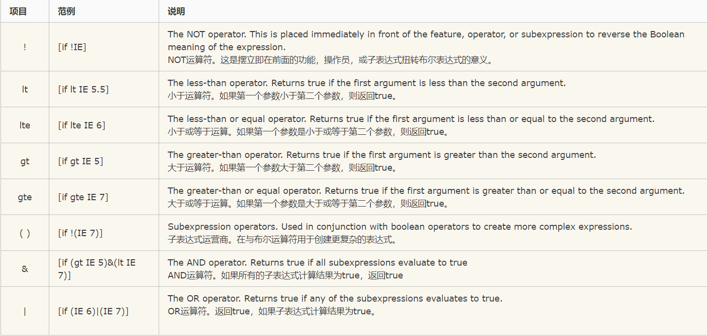

# 定位&盒模型相关

## 包含块

包含块简单说就是定位参考框或者定位参考坐标参考系，元素一旦定义了定位显示（相对，绝对，固定）都具有包含块性质，它所包含的定位元素都将以该包含块为坐标系进定位和调整

包含块是视觉格式化模型的一个重要概念，它与框模型类似，也可以理解为一个矩形，而这个矩形的作用是为它里面包含的元素提供一个参考，元素的尺寸和位置的计算往往是由该元素所在的包含块决定的

原理：一个元素盒子的位置和大小有时是通过相对于一个特定的长方形来计算的，这个长方形被称之为元素的containing box，一个元素的containing box按以下方式定义
    1.初始包含块是视口大小的矩形，不是视口
    2.对于其它元素，除非元素使用的绝对位置，包含块由最近的块级祖先元素盒子的内容边界组成
    3.如果元素有属性position:fixed包含块由视口建立
    4.如果元素有属性position:absolute包含块由最近的position不是static的祖先建立
        祖先为块元素，由祖先的padding edge组成
        如果没有祖先，包含块为初始包含块

## 盒模型相关属性默认值

left top right bottom 默认值auto
width height 默认值auto
margin padding 默认值0
border-width 默认值medium

## 盒模型百分比属性继承值

width height百分比是相对于包含块对应的width height取百分比

margin padding百分比是相对于包含块width取百分比

top left百分比是相对于包含块对应的height width取百分比

## 浮动

float最初的设计初衷，是为了实现图文混排效果，让文字环绕图片，float脱离文档流但不脱离文本流，也就是文本还会承认元素浮动前所占的区域，围绕它布局；但是其他元素比如div会忽视它的存在进行布局

# BFC

## BFC的定义

BFC(Block formatting context)直译为“块级格式化上下文”。它是一个独立的渲染区域，只有Block-level box参与，它规定了内部的Block-level box如何布局，并且与这个区域外部毫不相干

## BFC布局规则

1.内部的Box会在垂直方向，一个接一个放置
2.BFC的区域不会与float box重叠 （两列布局）
3.内部的box垂直方向的距离由margin决定，属于同一个BFC的两个相邻box的margin会发生重叠 （兄弟元素margin重叠问题）
4.计算BFC的高度时，浮动元素也参与计算（清除浮动 haslayout）
5.BFC就是页面上的一个隔离的独立容器，容器里面的元素不会影响到外面的元素，反之也如此。

## BFC开启方式

1.根元素
2.float属性不为none
3.position为absolute或fixed
4.overflow不为visible
5.display为inline-block,table-cell,table-caption,flex,inline-flex

# 三列布局

三列布局的要求：
1.中间优先加载
2.两边固定，中间自适应

## 圣杯伪等高布局

圣杯布局

```
<!DOCTYPE html>
<html lang="en">
<head>
    <meta charset="UTF-8">
    <title>圣杯布局</title>
    <style>
        
        * {
            margin: 0;
            padding: 0;
        }
        body {
            /* 2*left+right / 2*right+left */
            min-width: 600px;
        }
        #header {
            height: 50px;
            background-color: #2e8eda;
            text-align: center;
        }
        #footer {
            height: 50px;
            background-color: #c4e3f3;
            text-align: center;
        }
        #container {
            padding: 0 200px;
            zoom: 1;
            background-color: #bfa;
            overflow: hidden;
        }
        .clearFix:after {
            content: "";
            display: table;
            clear: both;
        }
        #container .left {
            position: relative;
            top: 0;
            left: -200px;
            margin-left: -100%;
            width: 200px;
            float: left;
            text-align: center;
            background-color: #2ab975;
        }
        #container .center {
            width: 100%;
            float: left;
            text-align: center;
            background-color: pink;
        }
        #container .right {
            position: relative;
            top: 0;
            left: 200px;
            margin-left: -200px;
            width: 200px;
            float: left;
            text-align: center;
            background-color: red;
        }
        #container .left , #container .center ,#container .right {
            padding-bottom: 10000px;
            margin-bottom: -10000px;
        }

    </style>
</head>
<body>
    <div id="header">header</div>
    <div id="container" class="clearFix">
        <div class="center">
            <p>center</p>
            <p>center</p>
            <p>center</p>
            <p>center</p>
            <p>center</p>
            <p>center</p>
            <p>center</p>
            <p>center</p>
            <p>center</p>
            <p>center</p>
            <p>center</p>
            <p>center</p>
            <p>center</p>
            <p>center</p>
            <p>center</p>
            <p>center</p>
            <p>center</p>
        </div>
        <div class="left">left</div>
        <div class="right">right</div>
    </div>
    <div id="footer">footer</div>

</body>
</html>
```

## 双飞翼伪等高布局

```
<!DOCTYPE html>
<html lang="en">
<head>
    <meta charset="UTF-8">
    <title>双飞翼布局</title>
    <style>
        * {
            margin: 0;
            padding: 0;
        }
        body {
            min-width: 600px;
        }
        #header , #footer {
            height: 100px;
            background-color: #2e8eda;
            text-align: center;
        }
        #container .center , #container .left , #container .right {
            float: left;
            text-align: center;
            padding-bottom: 10000px;
            margin-bottom: -10000px;
        }
        #container {
            background-color: #93a1a1;
            overflow: hidden;
        }
        .clearFix:after {
            content: "";
            display: table;
            clear: both;
        }
        #container .left {
            width: 200px;
            margin-left: -100%;
            background-color: #00FF00;
        }
        #container .center {
            width: 100%;
            background-color: crimson;
        }
        #container .center_inner {
            padding: 0 200px;
        }
        #container .right {
            width: 200px;
            margin-left: -200px;
            background-color: #d6e9c6;
        }
    </style>
</head>
<body>
    <div id="header">header</div>
    <div id="container" class="clearFix">
        <div class="center">
            <div class="center_inner">
                <p>center</p>
                <p>center</p>
                <p>center</p>
                <p>center</p>
                <p>center</p>
                <p>center</p>
                <p>center</p>
                <p>center</p>
                <p>center</p>
                <p>center</p>
            </div>
        </div>
        <div class="left">left</div>
        <div class="right">right</div>
    </div>
    <div id="footer">footer</div>

</body>
</html>
```

# 绝对定位模拟固定定位

滚动条是在初始包含块上，而不是在html或body上，如果html和body其中一个有overflow属性，滚动条出现在初始包含块上
想要滚动条出现在body上：html和body都有overflow属性，滚动条才会出现在body上
这样当我们滑动滚动条时，滚动的是body，而非初始包含块，而此时absolute是相对于初始包含块的

```
<!DOCTYPE html>
<html lang="en">
<head>
    <meta charset="UTF-8">
    <title>绝对定位模拟固定定位</title>
    <style>
        * {
            margin: 0;
            padding: 0;
        }
        html {
            overflow: hidden;
            height: 100%;
        }
        body {
            overflow: auto;
            height: 100%;
        }
        #test {
            position: absolute;
            top: 100px;
            left: 100px;
            width: 100px;
            height: 100px;
            background-color: #00FF00;
        }
    </style>
</head>
<body>
    <div id="test">

    </div>
    <div style="height: 1000px"></div>

</body>
</html>
```

# stickyFooter布局

```
<!DOCTYPE html>
<html lang="en">
<head>
    <meta charset="UTF-8">
    <meta name="viewport" content="width=device-width,initial-scale=1,maximum-scale=1,user-scalable=no,minimal-ui">
    <title>stickyFooter布局</title>
    <style type="text/css">
        * {
            margin: 0;
            padding: 0;
        }
        html , body {
            height: 100%;
        }
        #warp {
            min-height: 100%;
            padding-bottom: 50px;
        }
        #warp .main {
            height: 100%;
            text-align: center;
            overflow: auto;
        }
        #footer {
            height: 50px;
            line-height: 50px;
            text-align: center;
            margin-top: -50px;
            background-color: crimson;
        }
    </style>
</head>
<body>
    <div id="warp">
        <div class="main">
            main<br/>
            main<br/>
            main<br/>
            main<br/>
            main<br/>
            main<br/>
            main<br/>
            main<br/>
            main<br/>
            main<br/>
            main<br/>
            main<br/>
            main<br/>
            main<br/>
            main<br/>
            main<br/>
            main<br/>
            main<br/>
            main<br/>
            main<br/>
            main<br/>
            main<br/>
            main<br/>
            main<br/>
            main<br/>
            main<br/>
            main<br/>
            main<br/>
            main<br/>
            main<br/>
        </div>
    </div>
    <div id="footer">
        footer
    </div>
</body>
</html>
```


# 两列布局

```
<!DOCTYPE html>
<html lang="en">
<head>
    <meta charset="UTF-8">
    <title>BFC两列布局</title>
    <style>
        * {
            margin: 0;
            padding: 0;
        }
        #left {
            width: 200px;
            height: 200px;
            background-color: #00FF00;
            float: left;
        }
        #right {
            height: 200px;
            background-color: #d6e9c6;
            overflow: hidden;
        }

    </style>
</head>
<body>
    <div id="left">
        left
    </div>
    <div id="right">
        right
    </div>
</body>
</html>
```

# 兄弟元素margin重叠问题

```
<!DOCTYPE html>
<html lang="en">
<head>
    <meta charset="UTF-8">
    <title>兄弟元素margin重叠</title>
    <style>
        #up , #down {
            width: 200px;
            height: 200px;
            background-color: #d6e9c6;
            margin: 40px;
        }
        #warp {
            overflow: hidden;
        }
    </style>
</head>
<body>
    <div id="up"></div>
    <div id="warp">
        <div id="down">

        </div>
    </div>

</body>
</html>

```

# 父子元素margin传递问题

当两个空的块级元素嵌套时，如果内部的块设置有margin-top属性，那么内部块的margin-top属性会绑架父元素（即将margin-top传递给了父元素）。

```
<!DOCTYPE html>
<html lang="en">
<head>
    <meta charset="UTF-8">
    <title>父子元素margin传递</title>
    <style>
        #warp {
            width: 400px;
            height: 400px;
            background-color: #2e8eda;
        }
        #warp:before {
            content: "";
            display: table;
        }
        #inner {
            margin-top: 100px;
            width: 200px;
            height: 200px;
            background-color: #d6e9c6;
        }
    </style>
</head>
<body>
    <div id="warp">
        <div id="inner">

        </div>
    </div>
</body>
</html>
```

# haslayout

## haslayout的定义

haslayout是windows IE的一个私有概念，它决定元素如何对其内容定位和尺寸计算，以及与其他元素的关系和相互作用
当一个元素“拥有布局”时，它会负责本身及其子元素的尺寸和定位
当一个元素“没有拥有布局”时，它的尺寸和位置由最近的“拥有布局”的祖先元素控制
必须说明的是，IE8及以上的浏览器使用了全新的显示引擎，已经不存在haslayout属性，因此haslayout属性只针对IE6，IE7

## 默认拥有布局的元素

html body table tr td img hr input select textarea button iframe embed object applet marquee

## haslayout开启方式

float:left/right
display:inline-block
position:absolute
width/height:除auto外
zoom:除normal外
writing-moder:tb-rl

在IE7中，以下属性也可以开启haslayout
min-heght/min-width:任意值
max-height/max-width:除none外任意值
overflow/overflow-x/overflow-y:除visible外任意值
position:fixed


# 子元素浮动造成父元素高度塌陷问题

1.直接给父元素加height 
缺点：扩展性不好

2.父元素开启BFC overflow:hidden , float:left , position:absolute
缺点：浮动，定位元素默认高宽由内容撑开，margin失效。兼容性不高 IE6.7不支持BFC

3.br标签清除浮动，在浮动子元素下 br clear="all"
缺点：兼容性不高，IE6不支持。违反结构行为样式相分离的原则

4.浮动子元素下加空div clear:both
缺点：如有内容的话最小高度19px,设置font-size:0最小高度2px

5.伪元素after＋clear:both

# IE CSS hack

## 类内属性前缀法

“_″减号是IE6专有的hack
“\9″ IE6/IE7/IE8/IE9/IE10都生效
“\0″ IE8/IE9/IE10都生效，是IE8/9/10的hack
“\9\0″ 只对IE9/IE10生效，是IE9/10的hack

```
类内属性前缀法
background-color:red; /* All browsers */
background-color:blue !important;/* All browsers but IE6 */
*background-color:black; /* IE6, IE7 */
+background-color:yellow;/* IE6, IE7*/
background-color:gray\9; /* IE6, IE7, IE8, IE9, IE10 */
background-color:purple\0; /* IE8, IE9, IE10 */
background-color:orange\9\0;/*IE9, IE10*/
_background-color:green; /* Only works in IE6 */

等等
```

## 条件注释法

判断方式：
<!–[if !IE]><!–> 除IE外都可识别 <!–<![endif]–>
<!–[if IE]> 所有的IE可识别 <![endif]–>
<!–[if IE 6]> 仅IE6可识别 <![endif]–>
<!–[if lt IE 6]> IE6以及IE6以下版本可识别 <![endif]–>
<!–[if gte IE 6]> IE6以及IE6以上版本可识别 <![endif]–>
<!–[if IE 7]> 仅IE7可识别 <![endif]–>
<!–[if lt IE 7]> IE7以及IE7以下版本可识别 <![endif]–>
<!–[if gte IE 7]> IE7以及IE7以上版本可识别 <![endif]–>
<!–[if IE 8]> 仅IE8可识别 <![endif]–>
<!–[if IE 9]> 仅IE9可识别 <![endif]–>



# 盒模型垂直水平居中方案

## 已知盒模型高宽

方法一

```
<!DOCTYPE html>
<html lang="en">
<head>
    <meta charset="UTF-8">
    <title>已知高宽实现垂直水平居中</title>
    <style>
        * {
            margin: 0;
            padding: 0;
        }
        html , body {
            position: relative;
            width: 100%;
            height: 100%;
        }
        #test {
            position: absolute;
            top: 50%;
            left: 50%;
            margin: -100px 0 0 -100px;
            width: 200px;
            height: 200px;
            background-color: #2ab975;
        }
    </style>
</head>
<body>
    <div id="test"></div>
</body>
</html>
```

方法二

```
<!DOCTYPE html>
<html lang="en">
<head>
    <meta charset="UTF-8">
    <title>已知高宽实现垂直水平居中</title>
    <style>
        /*
            绝对定位盒子的特性
            水平方向上：
                left + right + width + padding + margin = 包含块内容区的尺寸
            垂直方向：
                top + bottom + height + padding + margin = 包含块内容区的尺寸
         */
        * {
            margin: 0;
            padding: 0;
        }
        html , body {
            position: relative;
            width: 100%;
            height: 100%;
        }
        #test {
            position: absolute;
            top: 0;
            left: 0;
            bottom: 0;
            right: 0;
            margin: auto;
            width: 200px;
            height: 200px;
            background-color: #2ab975;
        }
    </style>
</head>
<body>
    <div id="test"></div>
</body>
</html>
```

## 未知盒模型高宽

```
<!DOCTYPE html>
<html lang="en">
<head>
    <meta charset="UTF-8">
    <title>未知高宽实现垂直水平居中</title>
    <style>
        * {
            margin: 0;
            padding: 0;
        }
        html , body {
            position: relative;
            width: 100%;
            height: 100%;
        }
        #test {
            position: absolute;
            top: 50%;
            left: 50%;
            transform: translate3d(-50% , -50% , 0);
            background-color: #2ab975;
        }
    </style>
</head>
<body>
    <div id="test">
        testtesttesttesttest<br/>
        testtesttesttesttest<br/>
        testtesttesttesttest<br/>
        testtesttesttesttest<br/>
    </div>
</body>
</html>
```

# 图片垂直水平居中方案

CSS 的属性 vertical-align 用来指定行内元素（inline）或表格单元格（table-cell）元素的垂直对齐方式。注意 vertical-align 只对行内元素、表格单元格元素生效：不能用它垂直对齐块级元素。

```
<!DOCTYPE html>
<html lang="en">
<head>
    <meta charset="UTF-8">
    <title>图片垂直水平居中</title>
    <style>
        * {
            margin: 0;
            padding: 0;
        }
        html , body {
            height: 100%;
            text-align: center;
        }
        body:after {
            content: "";
            display: inline-block;
            height: 100%;
            vertical-align: middle;
        }
        img {
            width: 200px;
            vertical-align: middle;
        }
    </style>

</head>
<body>
    
</body>
</html>
```

