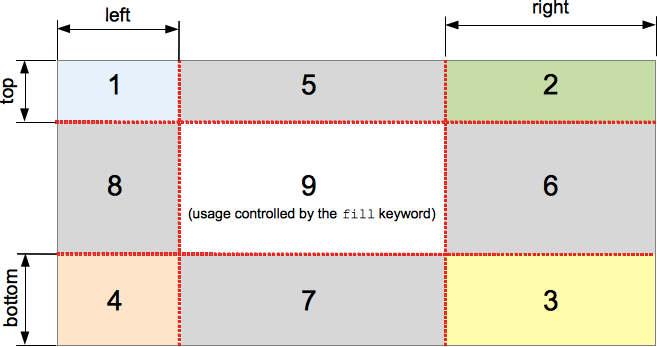
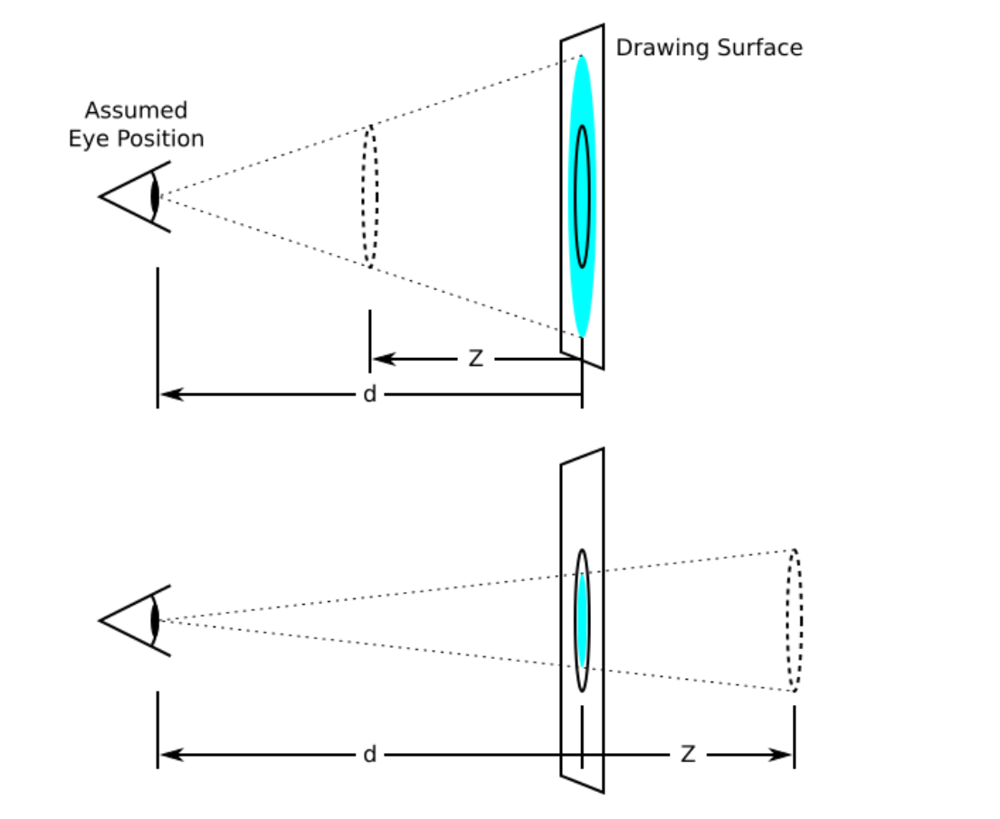
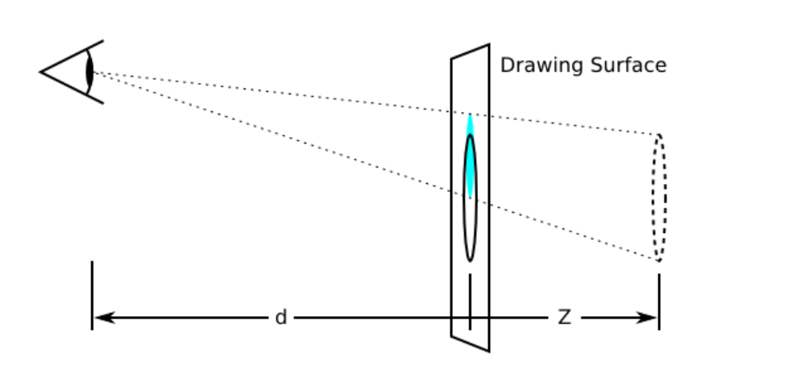

# 导学
CSS全称Cascading Style Sheets

样式表由规则组成，规则由选择器＋声明块组成（CSS属性+CSS属性值组成的键值对）

浏览器读取选择器的顺序为从从右往左

# CSS声明的优先级

## 选择器的特殊性

选择器的特殊性右选择器本身的组件确定，特殊性值表述为四个部分，如0，0，0，0

一个选择器的具体特殊性如下确定：
1.内联声明的特殊性都是 1，0，0，0
2.ID选择器的特殊性为 0，1，0，0
3.类，属性和伪类选择器的特殊性为 0  ，0，1，0
4.元素和伪元素选择器的特殊性为 0，0，0，1
5.通配符选择器的特殊性 0，0，0，0
6.结合符对选择器特殊性没有一点贡献
7.继承没有特殊性

特殊性 1，0，0，0 大于所有以0开头的特殊性（不进位）
选择器的特殊性最终都会授予给其对应的声明
如果多个规则与同一个元素匹配，而且有些声明互相冲突时，特殊性越大的越占优势

## 重要声明

有时某个声明比较重要，超过了所有其他声明，CSS2.1称之为重要声明
并允许在这些声明的结束分号之前插入 !important 来标志
必须要准确地放置 !important 否则声明无效
!important 总是放在声明的最后，即分号的前面

重要声明并没有特殊的特殊性值，要与非重要声明分开考虑
实际上所有的重要声明会被浏览器分为一组，重要声明的冲突会在其内部解决
非重要声明也会分为一组，非重要声明的冲突也会在其内部解决
如果一个重要声明与非重要声明冲突，胜出的总是重要声明

## CSS来源

CSS样式的来源大致为三种：
1.开发人员
2.用户（Internet选项-辅助功能-用户样式表）
3.用户代理

权重（由高到底）：
用户的重要声明
开发人员的重要声明
开发人员的正常声明
用户的正常声明
用户代理的声明

## 层叠

1.找出所有相关的规则，这些规则都包含一个选择器
2.计算声明的优先级
    先按来源排序
    再按选择器的特殊性排序
    最后按顺序
    
# 自定义字体&字体图标

@font-face CSS at-rule 指定一个用于显示文本的自定义字体；字体能从远程服务器或者用户本地安装的字体加载. 如果提供了local()函数，从用户本地查找指定的字体名称，并且找到了一个匹配项, 本地字体就会被使用. 否则, 字体就会使用url()函数下载的资源。
 
通过允许作者提供他们自己的字体，@font-face 让设计内容成为了一种可能，同时并不会被所谓的"网络-安全"字体所限制(字体如此普遍以至于它们能被广泛的使用). 指定查找和使用本地安装的字体名称可以让字体的自定义化程度超过基本字体，同时在不依赖网络情况下实现此功能。
 
在同时使用url()和local()功能时，为了用户已经安装的字体副本在需要使用时被使用，如果在用户本地没有找到字体副本就会去使用户下载的副本查找字体。
 
@font-face 规则不仅仅使用在CSS的顶层，还可以用在任何CSS条件组规则中.
取值：

font-family
所指定的字体名字将会被用于font或font-family属性

src
远程字体文件位置的URL或者用户计算机上的字体名称， 可以使用local语法通过名称指定用户的本地计算机上的字体
如果找不到该字体，将会尝试其他来源，直到找到它。

font-variant
font-stretch
font-weight
font-style
对于src所指字体的描述。如果所需字体符合描述，则采用本font-face所定义的字体。

unicode-range
在该@font-face中定义的unicode字体范围

```
@font-face {
  font-family: "Open Sans";
  src: url("/fonts/OpenSans-Regular-webfont.woff2") format("woff2"),
       url("/fonts/OpenSans-Regular-webfont.woff") format("woff");
}
```

# 文本新增样式

## opacity

改变透明度
不是一个可继承属性
0~1

## rgba

a表示透明度，实现背景和文字透明度分离
```
p {
    color: rgba(255, 150, 250, .8);
    background-color: rgba(0, 0, 0, 1);
}
```

## text-shadow

text-shadow为文字添加阴影。可以为文字与  text-decorations  添加多个阴影，阴影值之间用逗号隔开。每个阴影值由元素在X和Y方向的偏移量、模糊半径和颜色值组成。
默认值：none 不可继承

取值

color
可选。可以在偏移量之前或之后指定。如果没有指定颜色，则使用UA（用户代理）自行选择的颜色。
Note: 如果想确保跨浏览器的一致性，请明确地指定一种颜色

offset-x offset-y
必选。这些长度值指定阴影相对文字的偏移量。offset-x 指定水平偏移量，若是负值则阴影位于文字左边。 offset-y 指定垂直偏移量，若是负值则阴影位于文字上面。如果两者均为0，则阴影位于文字正后方（如果设置了blur-radius 则会产生模糊效果)。

blur-radius
可选。这是 length 值。如果没有指定，则默认为0。值越大，模糊半径越大，阴影也就越大越淡

语法
```
/* offset-x | offset-y | blur-radius | color */
text-shadow: 1px 1px 2px black; 

/* color | offset-x | offset-y | blur-radius */
text-shadow: #fc0 1px 0 10px; 

/* offset-x | offset-y | color */
text-shadow: 5px 5px #558abb;

/* color | offset-x | offset-y */
text-shadow: white 2px 5px;

/* offset-x | offset-y
/* Use defaults for color and blur-radius */
text-shadow: 5px 10px;

/* Global values */
text-shadow: inherit;
text-shadow: initial;
text-shadow: unset;
```

## 文字描边

只有webkit才支持：-webkit-text-stroke（准确来说不能算是CSS3的东西，但需要知道）
-webkit-text-stroke CSS属性为文本字符指定了宽 和 颜色 . 它是-webkit-text-stroke-width 和-webkit-text-stroke-color属性的缩写.

语法
```
/* 宽度和颜色属性 */
-webkit-text-stroke: 4px navy;
/* 全局属性 */
-webkit-text-stroke: inherit;
-webkit-text-stroke: initial;
-webkit-text-stroke: unset;
```

## 文字排版

CSS属性 direction 用来设置文本、表列水平溢出的方向。  rtl 表示从右到左 (类似希伯来语或阿拉伯语)， ltr 表示从左到右 (类似英语等大部分语言).
一定要配合unicode-bidi:bidi-override;来使用

取值
ltr
默认属性。可设置文本和其他元素的默认方向是从左到右。

rtl
可设置文本和其他元素的默认方向是从右到左。
```
p {
    direction: rtl;
    unicode-bidi: bidi-override;
}
```

溢出显示省略号(条件：盒子不能靠内容撑开)
```
white-space:nowrap;
overflow:hidden;
text-overflow:ellipsis
```

# 盒模型新增样式

## 盒模型阴影

box-shadow

box-shadow 属性用于在元素的框架上添加阴影效果 ，该属性可设置的值包括，X偏移，Y偏移，阴影模糊半径，阴影扩散半径，和阴影颜色并以多个逗号分隔。
初始值none 适用于几乎任何元素 不可继承

取值：

inset
如果没有指定inset，默认阴影在边框外，即阴影向外扩散。
使用 inset 关键字会使得阴影落在盒子内部，这样看起来就像是内容被压低了。 此时阴影会在边框之内 (即使是透明边框）、背景之上、内容之下。

offset-x offset-y
这是头两个 length 值，用来设置阴影偏移量。x,y 是按照数学二维坐标系来计算的，只不过y垂直方向向下。  offset-x 设置水平偏移量，正值阴影则位于元素右边，负值阴影则位于元素左边。 offset-y 设置垂直偏移量，正值阴影则位于元素下方，负值阴影则位于元素上方。可用单位请查看 length。
如果两者都是0，那么阴影位于元素后面。这时如果设置了blur-radius 或spread-radius 则有模糊效果。需要考虑 inset 

blur-radius
这是第三个 length 值。值越大，模糊面积越大，阴影就越大越淡。 不能为负值。默认为0，此时阴影边缘锐利。本规范不包括如何计算模糊半径的精确算法

spread-radius
这是第四个 length 值。取正值时，阴影扩大；取负值时，阴影收缩。默认为0，此时阴影与元素同样大。需要考虑 inset

color
相关事项查看 color 。如果没有指定，则由浏览器决定——通常是color的值，不过目前Safari取透明。

语法
```
/* x偏移量 | y偏移量 | 阴影颜色 */
box-shadow: 60px -16px teal;

/* x偏移量 | y偏移量 | 阴影模糊半径 | 阴影颜色 */
box-shadow: 10px 5px 5px black;

/* x偏移量 | y偏移量 | 阴影模糊半径 | 阴影扩散半径 | 阴影颜色 */
box-shadow: 2px 2px 2px 1px rgba(0, 0, 0, 0.2);

/* 插页(阴影向内) | x偏移量 | y偏移量 | 阴影颜色 */
box-shadow: inset 5em 1em gold;

/* 任意数量的阴影，以逗号分隔 */
box-shadow: 3px 3px red, -1em 0 0.4em olive;

/* 全局关键字 */
box-shadow: inherit;
box-shadow: initial;
box-shadow: unset;
```

## 倒影

-webkit-box-reflect
只有webkit才支持,准确来说不是CSS3的内容，但需要知道
默认值none 不可继承

取值
倒影的方向
第一个值：above below right left

倒影的距离
第二个值：长度单位

渐变
第三个值 如 linear-gradient()

## resize

resize CSS属性允许你控制一个元素的可调整大小性
注意：一定要配合overflow:auto来使用
默认值none 不可继承

取值
none：元素不能被用户缩放
both：允许用户在水平和垂直方向上调整元素的大小
horizontal：允许用户在水平方向上调整元素的大小
vertical：允许用户在垂直方向上调整元素的大小

## box-sizing

CSS 中的 box-sizing 属性定义了 user agent 应该如何计算一个元素的总宽度和总高度。

在 CSS 盒子模型的默认定义里，你对一个元素所设置的 width 与 height 只会应用到这个元素的内容区即content-box。如果这个元素有任何的 border 或 padding ，绘制到屏幕上时的盒子宽度和高度会加上设置的边框和内边距值。这意味着当你调整一个元素的宽度和高度时需要时刻注意到这个元素的边框和内边距。当我们实现响应式布局时，这个特点尤其烦人。

box-sizing 属性可以被用来调整这些表现:

content-box  是默认值。如果你设置一个元素的宽为100px，那么这个元素的内容区会有100px 宽，并且任何边框和内边距的宽度都会被增加到最后绘制出来的元素宽度中。

border-box 告诉浏览器：你想要设置的边框和内边距的值是包含在width内的。也就是说，如果你将一个元素的width设为100px，那么这100px会包含它的border和padding，内容区的实际宽度是width减去(border + padding)的值。大多数情况下，这使得我们更容易地设定一个元素的宽高。

尺寸计算公式：
width = border + padding + 内容的宽度
height = border + padding + 内容的高度

注意：border-box不包含margin

# 新增UI样式

## 圆角

border-radius

CSS 属性 border-radius 允许你设置元素的外边框圆角。当使用一个半径时确定一个圆形，当使用两个半径时确定一个椭圆。这个(椭)圆与边框的交集形成圆角效果。该属性是一个 简写属性，是为了将这四个属性 border-top-left-radius、border-top-right-radius、border-bottom-right-radius，和 border-bottom-left-radius 简写为一个属性。
默认值0 不可继承

取值
固定的px值定义圆形半径或椭圆的半长轴，半短轴。不能用负值
使用百分比定义圆形半径或椭圆的半长轴，半短轴。水平半轴相当于盒模型的宽度，垂直半轴相当于盒模型的高度。不能用负值

```
border-radius:10px;
border-radius:10px / 50px;
```

注意：百分比值在旧版本Chrome和Safari中不支持
在11.50版本以前的Opera中实现有问题
Gecko2.0（Firefox4）版本前实现不标准，水平半轴和垂直半轴都相对于盒子模型的宽度
在旧版本的iOS（iOS5之前）和Android中（webkit 532之前）不支持

## 边框图片

border-image CSS属性允许在元素的边框上绘制图像，这使得绘制复杂的外观组件更加简单，使用 border-image 时，其将会替换掉border-style属性所设置的边框样式

### border-image-source

定义使用一张图片来替代边框样式；如果值为none，则仍然使用border-style定义的样式
默认值：none 不可继承
`border-image-source: url("./img/12.jpg");`

### border-image-slice

通过border-image-source 引用边框图片后，border-image-slice属性会将图片分割为9个区域：四个角，四个边（edges）以及中心区域。四条切片线，从它们各自的侧面设置给定距离，控制区域的大小。


区域 1-4 为角区域（corner region）。 每一个都用一次来形成最终边界图像的角点。（Each one is used a single time to form the corners of the final border image.）
区域 5-8 边区域（edge region）。在最终的边框图像中重复，缩放或修改它们以匹配元素的尺寸。（These are repeated, scaled, or otherwise modified in the final border image to match the dimensions of the element.）
区域 9 为中心区域（ middle region）。它在默认情况下会被丢弃，但如果设置了关键字fill，则会将其用作背景图像。（It is discarded by default, but is used like a background image if the keyword fill is set.）
中间的区域将不会被边框使用，但当设置有 fill 关键词时将会被作为 background-image。这个关键词可以被设置在属性的任何一个位置(前面、后面或者两个值之间)

border-image-repeat, border-image-width, border-image-outset 属性则定义这些图片将如何使用。

语法
```
/* 所有的边 */
border-image-slice: 30%; 

/* 垂直方向 | 水平方向 */
border-image-slice: 10% 30%;

/* 顶部 | 水平方向 | 底部 */
border-image-slice: 30 30% 45;

/* 上 右 下 左 */
border-image-slice: 7 12 14 5; 

/* 使用fill（fill可以放在任意位置） */
border-image-slice: 10% fill 7 12;

```

### border-image-repeat

定义图片如何填充边框。或为单个值，设置所有的边框；或为两个值，分别设置水平与垂直的边框。
默认值为拉升 不可继承

可选值
```
type
stretch, repeat, round, space 选一。属于单个值的情况。

horizontal
stretch, repeat, round, space 选一。属于两个值的情况。

vertical
stretch, repeat, round, space 选一。属于两个值的情况。

stretch
拉伸图片以填充边框。

repeat
平铺图片以填充边框。

round
平铺图像。当不能整数次平铺时，根据情况放大或缩小图像。

space
平铺图像 。当不能整数次平铺时，会用空白间隙填充在图像周围（不会放大或缩小图像）

inherit
继承父级元素的计算值。
```

### border-image-width

定义图像边框宽度。假如border-image-width大于已指定的border-width，那么它将向内部(padding/content)扩展.

### border-image-outset

定义边框图像可超出边框盒的大小。可使边框外扩，只有正值

## 背景

### CSS2背景相关

#### background-color

设置背景色 默认值transparent（CSS3定义的）透明色 不可继承

#### background-image

为一个元素设置一个或多个背景图像（CSS3定义的多个背景图像）
注意：背景图像在绘制时，以Z轴方向堆叠的方式进行，先指定的图像会在之后指定的图像上进行绘制
注意：background-color会在image之下进行绘制，边框和内容会在image之上进行绘制

#### background-repeat

定义背景图片的重复方式，默认值repeat 不可继承
可选值：
repeat 默认值，背景图片双向重复（平铺）
no-repeat 背景图片不会重复
repeat-x 背景图片沿水平方向重复
repeat-y 背景图片沿垂直方向重复

#### background-position

设置背景图片在元素中的位置
可选值：
top right left bottom center中的两个值来指定一个背景图片的位置
top left 左上
bottom right 右下
如果只给出一个值，则第二个值默认是center
也可以直接指定两个偏移量
第一个值是水平偏移量
    如果指定的是一个正值，则图片会向右移动指定的像素
    如果指定的是一个负值，则图片会向左移动指定的像素
第二个是垂直偏移量
    如果指定的是一个正值，则图片会向下移动指定的像素
    如果指定的是一个负值，则图片会向上移动指定的像素

百分比的参照尺寸为背景图片定位区域减去背景图片的大小

#### background-attachment

background-attachment 设置背景图片是否随页面一起滚动
     可选值：
         scroll 默认值，背景图片随着窗口滚动
         fixed 背景会固定在某一位置，不随页面滚动
     不随窗口滚动的图片，我们一般都是设置给body,而不设置给其他元素

### CSS3背景相关新增

首先背景默认是从padding-box左上开始绘制，以boder-box右下为边界进行剪裁

#### background-origin

background-origin 规定了指定背景图片background-image 属性的原点位置的背景相对区域.
初始值padding-box 不可继承
注意：当使用 background-attachment 为fixed时，该属性将被忽略不起作用。

属性值：
border-box
背景图片的摆放以border区域为参考

padding-box
背景图片的摆放以padding区域为参考

content-box
背景图片的摆放以content区域为参考

#### background-clip

background-clip  设置元素的背景（背景图片或颜色）是否延伸到边框下面。
如果没有设置背景图片（background-image）或背景颜色（background-color），那么这个属性只有在边框（ border）被设置为非固实（soild）、透明或半透明时才能看到视觉效果（与 border-style 或 border-image 有关），否则，本属性产生的样式变化会被边框覆盖。

属性值：
border-box
背景延伸至边框外沿（但是在边框下层）。

padding-box
背景延伸至内边距（padding）外沿。不会绘制到边框处。

content-box
背景被裁剪至内容区（content box）外沿。

text
背景被裁剪成文字的前景色。

#### background-size

background-size设置背景图片的大小
默认值auto 不可继承

属性值：
    百分比：指定背景图片相对背景区的百分比。背景区由background-origin设置。默认为盒模型的内容区和内边距
    auto：以背景图片的比例缩放背景图片

注意：单值时，这个值设置的是图片的宽度，图片的高度为auto
两个值时，第一个值设置图片的宽度，第二个值设置图片的高度


#### background

此属性是一个 简写属性，可以在一次声明中定义一个或多个属性：background-clip、background-color、background-image、background-origin、background-position、background-repeat、background-size，和 background-attachment。

对于所有简写属性，任何没有被指定的值都会被设定为它们的 初始值。
不建议使用

### 渐变

#### 线性渐变

渐变是图片

为了创建一个线性渐变，需要一个起始点和一个方向（指定一个角度），还需要定义终止色（两种颜色或更多）

默认从上到下发生渐变
`background-image: linear-gradient(red,blue);`

##### 改变渐变的方向

background-image: linear-gradient(to 结束方向，颜色1，颜色2)
如：`background-image: linear-gradient(to top，red，blue)`

使用角度
垂直向上为0，垂直向下为180，水平向右90，水平向左-90
background-image: linear-gradient(角度deg，颜色1，颜色2)

##### 控制颜色节点的分步

在颜色后添加长度或百分比，定义颜色节点
如：background-image: linear-gradient(45deg，red 10px，blue 20px)

##### 重复渐变

repeating-linear-gradient(60deg, red 10px, green 30px)

##### 实例:发廊灯

```
<!DOCTYPE html>
<html>
    <head>
        <meta charset="UTF-8">
        <title>
            发廊灯
        </title>
        <style>
            * {
                margin: 0;
                padding: 0;
            }
            html, body {
                height: 100%;
                overflow: hidden;
            }
            #wrap {
                position: absolute;
                top: 0;
                left: 0;
                right: 0;
                bottom: 0;
                margin: auto;
                width: 40px;
                height: 300px;
                border: 1px solid;
                overflow: hidden;
            }

            #wrap > .inner {
                height: 300px;
                background-image: repeating-linear-gradient(135deg, black 0, black 10px, white 10px, white 20px);
            }
        </style>
    </head>
    <body>
        <div id="wrap">
            <div class="inner">

            </div>
        </div>
    </body>
    <script>
        var inner = document.querySelector("#wrap > .inner");
        var flag = 0;
        setInterval (function () {
            flag += 1;
            inner.style.height = (300 + flag + "px");
            inner.style.marginTop = -flag + "px";
        }, 10)
    </script>
</html>
```
##### 实例:光斑动画

```
<!DOCTYPE html>
<html>
    <head>
        <meta charset="UTF-8">
        <title>光斑动画</title>
        <style>
            * {
                margin: 0;
                padding: 0;
            }

            html, body {
                height: 100%;
                overflow: hidden;
                text-align: center;
                background-color: black;
            }

            h1 {
                display: inline-block;
                color: rgba(245, 242, 58, 0.767);
                font: bold 100px "方正粗雅宋";
                margin-top: 20px;
                background-image: linear-gradient(135deg, rgba(255, 255, 255, 0) 80px, rgba(255, 255, 255, 1) 100px, rgba(255, 255, 255, 0) 150px);
                -webkit-background-clip: text;
                background-repeat: no-repeat;
                background-position: -400px;
            }
        </style>
    </head>
    <body>
        <h1>北梦夏栀</h1>
    </body>
    <script>
        var h1 = document.querySelector("h1");
        var flag = 0;
        setInterval(function (){
            flag++;
            if (flag == 800) {
                flag = 0;
            }
            h1.style.backgroundPositionX = -400 + flag + "px";
        }, 5);
    </script>
</html>
```
#### 径向渐变

CSS radial-gradient() 函数创建了一个图片，其由一个从原点辐射开的在两个或者多个颜色之前的渐变组成。这个方法得到的是一个CSS`<gradient>`数据类型的对象，其是 `<image> `的一种。
与其他渐变相同，径向渐变是一个不固定尺寸的图片，譬如，它没有默认尺寸、比例。具体尺寸由它所定义的元素尺寸决定。
如需要填充容器的循环渐变，请使用CSS的repeating-radial-gradient 方法。
因为` <gradient> `属于 `<image>` 类型，所以它可以用于任何适用于 `<image>` 的地方。正是因为这样，radial-gradient() 不能用于 background-color 和其他属性比如 `<color>` 数据类型。

例：`background-image: radial-gradient(red 10%, blue 30%, yellow 70%);`

##### 改变渐变形状

默认为ellipse椭圆
`background-image: radial-gradient(circle, red, yelllow)`

##### 改变渐变形状的大小

默认为farthest-corner最近角到中心划分
属性值：
closest-side 最近边
farthset-side 最远边
closest-corner 最近角
farthset-corner 最远角

`background-image: radial-gradient(farthset-side circle, red, yelllow)`

##### 改变圆心

`background-image: radial-gradient(farthset-side circle at 20px 20px, red, yelllow)`

# 过渡（transition）

## transition-property

指定应用过渡属性的样式
默认值为all,表示所有可被动画的属性都表现出过渡动画
可以指定多个property

## transition-duration

属性以秒或毫秒为单位指定过渡动画所需的时间（一定要加单位！）
默认值为0s，表示不出现过渡动画

可以指定多个时长，每个时长都会被应用到由transition-property指定的对应属性上，如果指定的时长个数小于属性个数，那么时长列表会重复。如果时长列表更长，那么该列表会被裁减，两种情况下，列表属性都保持不变

## transition-timing-function

可以规定多个timing-function，通过transition-property属性，可以根据主列表（transition-property的列表）给每个CSS属性相应的timing-function，如果timing-function的个数比主列表数量要少，缺少的值被设置为初始值（ease），如果timing-function比主列表更多，timing-function函数列表会被截断至合适的大小。这两种情况下声明的CSS属性都是有效的

属性值
1.ease：（加速再减速）ease函数相当于贝塞尔曲线（0.25，0.1，0.25，1.0）
2.linear：（匀速）linear函数相当于贝塞尔曲线（0.0，0.0，1.0，1.0）
3.ease-in：（加速）ease-in函数相当于贝塞尔曲线（0.42，0.0，1.0，1.0）
4.ease-out：（减速）（0.0，0.0，0.58，1.0）
5.ease-in-out：（加速然后减速）（0.42，0.0，0.58，1.0）
6.cubic-bezier:（贝塞尔曲线）
7.step-start：等同于steps(1,start)
   step-end：等同于steps(1,end)
   steps(`<integer>`,[start[end]]?)
   第一个参数：必须为正整数，指定函数的步数
   第二个参数：指定每一步的值发生变化的时间点，默认为end

## transition-delay

该属性规定了在过渡效果开始作用之前需要等待的时间
默认值为0s
可以指定多个延迟时间，每个延迟时间将会分别作用于你所指定的相符合的css属性。如果指定的时长个数小于属性个数，那么时长列表将会重复，如果时长列表更长，那么该列表会被裁减。两种情况下，属性列表都保持不变

## 检测过渡是否完成

当过渡完成时触发一个事件，在符合标准的浏览器下，这个事件是transitionend，在webkit下是webkitTransitionEnd
(每一个拥有过渡的属性在其完成过渡时都会触发一次transitionend事件)

在transition完成前设置display:none 时间同样不会触发

## transition过渡中只关注初始状态和结束状态，没有方法可以获取到过渡中每一帧的状态

## transition过渡在元素首次渲染还没结束的情况下是不会触发的

## transition过渡在绝大部分样式切换时，如果transform变换函数的位置，个数不相同也不会触发

## transition

CSS效率极高，其样式变化往往都是一瞬完成。
transition提供了一种在更改CSS属性时控制动画速度的方法。其可以让属性变化变成一个持续一段时间的过程，而不是立即生效的。
transition CSS 属性是 transition-property，transition-duration，transition-timing-function 和 transition-delay 的一个简写属性。
默认值
transition-delay:0s
transition-duration:0s
transition-property:all

注意：transition属性中，各个值的书写顺序很重要，第一个可以解析为时间的值会赋值给transition-duration，第二个可以解析为时间的值会赋值给transition-delay

推荐书写顺序
过渡时间 过渡样式 过渡形式 延迟时间，过渡时间 过渡样式 过渡形式 延迟时间...

# 2D变形（transform）

transform属性允许你修改CSS视觉格式模型的坐标空间
transform属性只对block级元素有效
内部变换都是矩阵变换

注意：transform只对块级元素有效

## 旋转（rotate）

`transform: rotate(360deg);`

## 平移（translate）

X方向平移：`transform: translateX(200px);`
Y方向平移：`transform: translateY(200px);`

二维平移：`transform: translate(200px, 200px);`
可单值可双值可正可负，第一个值为X方向，第二个值为Y 方向

## 倾斜（skew）

X方向倾斜：`transform: skewX(45deg);`
Y方向倾斜：`transform: skewY(45deg);`

二维倾斜：`transform: skew(45deg, 45deg);`
同平移translate

## 缩放（scale）

X方向缩放：`transform: scaleX(0.5);`
Y方向缩放：`transform: scaleY(2);`

二维缩放：`transform: scale(0.5, 2);`
正值表示缩放程度，单值时X，Y方向缩放相同
不推荐使用负值由旋转效果

## 基点的变换（只对位移无影响）

`transform-orign: top left;`
`transform-orign: 50px 10px;`
`transform-orign: 50% 10%;`

# 2D变形组合

2D变形内部都是矩阵变换，矩阵变换不可逆，没有交换律
2D变形组合底层时从右往左进行矩阵变换（但使用时按字面意思从左往右理解）

## 实例:扇形导航

```
<!DOCTYPE html>
<html lang="en">
<head>
    <meta charset="UTF-8">
    <title>扇形导航</title>
    <style>
        * {
            margin: 0;
            padding: 0;
        }
        html, body {
            height: 100%;
            overflow: hidden;
        }
        img {
            width: 50px;
        }
        #wrap {
            position: fixed;
            right: 10px;
            bottom: 10px;
            width: 50px;
            height: 50px;

        }
        #inner {
            height: 100%;
        }
        #inner > img {
            position: absolute;
            left: 0;
            top: 0;
            width: 50px;
            border-radius: 25px;
            background-color: rgba(255, 255, 255, 1);
        }
        #home {
            position: absolute;
            top: 0;
            left: 0;
            width: 50px;
            height: 50px;
            border-radius: 25px;
            background-color: rgba(255, 255, 255, 1);
            transition: 1.5s;
        }

    </style>
</head>
<body>
    <div id="wrap">
        <div id="inner">
            
            
            
            
        </div>
        <div id="home">
            
        </div>
    </div>
</body>
<script>
    window.onload = function () {
        var homeEle = document.querySelector("#home");
        var imgs =document.querySelectorAll("#inner img");
        var flag = true;
        var c = 140;
        function fn() {
            this.style.transition = "0.2s";
            this.style.transform = "rotate(-360deg) scale(1)";
            this.style.opacity = "1";
            this.removeEventListener("transitionend", fn);
        }
        function getPoint(c, deg){
            var x = Math.round(c * Math.sin(deg * Math.PI /180));
            var y = Math.round(c * Math.cos(deg * Math.PI /180));
            return{left:x, top:y};
        }
        homeEle.onclick = function () {
            if (flag) {
                this.style.transform = "rotate(-720deg)";
                for (var i = 0; i < imgs.length; i++) {
                    imgs[i].style.transition = 0.5 + (i * 0.4) + "s";
                    imgs[i].style.transform = "rotate(-360deg) scale(1)";
                    imgs[i].style.left = -getPoint(c,90 * i / (imgs.length - 1)).left + "px";
                    imgs[i].style.top = -getPoint(c,90 * i / (imgs.length - 1)).top + "px";
                }
            } else {
                this.style.transform = "rotate(720deg)";
                for (var i = 0; i < imgs.length; i++) {
                    imgs[i].style.transition = 0.5 + ((imgs.length - i - 1) * 0.4) + "s";
                    imgs[i].style.transform = "rotate(0deg) scale(1)";
                    imgs[i].style.left = 0 + "px";
                    imgs[i].style.top = 0 + "px";
                }
            }
            flag = !flag
        }
        for (var i = 0; i < imgs.length; i++) {
            imgs[i].onclick = function () {
                this.style.transition = "0.2s";
                this.style.transform = "scale(2)";
                this.style.opacity = "0.1";
                this.addEventListener("transitionend", fn);
            };
        }

    }
</script>
</html>
```

# 3D变形

## 透视（perspective）

在CSS3中，perspective用于激活一个3D空间，使具有3D变换的后代元素产生透视效果，属性值就是透视大小（默认none无透视）

perspective和perspective-origin属性能给舞台（scene，变换元素所处的空间）添加纵深感，结果就是元素距离观看者越近就表现得越大，越远就表现得越小（通过变换可以改变元素在Z轴上的位置）。

perspective属性指定观看者的眼睛（假设的）与屏幕 （drawing plane）之间的距离。如果将perspective属性的值设为d，则元素的缩放比例就等于d/(d − z)，z是元素在Z轴上的位置，更准确的说是变换前元素所在的与Z轴垂直的平面在Z轴上的坐标位置。


简单的理解：透视就是人眼距离屏幕的距离
透视的作用是使3D场景产生近大远小的效果
透视是一个不可继承属性，但它可以作用于所有的后代元素

形式：
transform:perspective(depth);
depth的默认值是none，可以设置为一个长度值，这个长度是沿着Z轴距离坐标原点的距离。
若使用perspective()函数，那么它必须放置在transform属性的首位，如果放在其他函数之后，则会被忽略。
这种写法的透视是作用于本身的，一般不使用

perspective:depth;
和perspective()函数一样，depth的默认值是none，可以设置为一个长度值，这个长度是沿着Z轴距离坐标原点的距离。
区别在于perspective属性被用于元素的后代元素，而不是元素本身
应用透视的元素被称为“舞台元素”，舞台元素的所有后代都会受影响（如果后代元素中也添加了perspective属性，效果会叠加不是覆盖）

### 灭点

指的是立体图形沿各条边的延伸线所产生的相交点即透视点的相交点
透视越大，灭点越远，元素变形越小

### 透视基点

透视基点为视角的位置
默认情况下，观看者的眼睛正对着的位置在drawing（surface）的中心。然而可以通过perspective-origin属性改变这个位置（for example, if a web page contains multiple drawings that should share a common perspective property，这句英语是理解perspective与perspective()区别的关键）。

透视基点由两个属性控制
perspective:depth;
perspective-origin(xlength, ylength);
perspective-origin默认值为50%，50%

## transform-style

transform-style营造有层级的3D舞台
这是一个不可继承属性，它作用于子元素

值：
flat
设置元素的子元素位于该元素的平面中。
preserve-3d
指示元素的子元素应位于 3D 空间中。

## 3D缩放

transform:scaleZ(number);
transform:scale3d(scaleX, scaleY, scaleZ);

如果只设置scaleZ(number),会发现元素并没有被放大或压缩，scaleZ(number)需要和translateZ(length)配合使用，number称以length得到的值，是元素沿Z轴移动的距离，从而使得感觉被放大或压缩

## 3D旋转

transform: rotateX(angle);
transform: rotateY(angle);
transform: rotateZ(angle);

分别以X，Y，Z正轴作顺时针旋转
```
transform: rotateX(360deg);
transform: rotateY(360deg);
transform: rotateZ(360deg);
```

transform: rotate3d(x, y, z, angle);

x,y,z分别接受一个数值（number），用来计算矢量方向（direction vector），矢量方向是三维空间中的一条线：从坐标系原点到（x, y, z），元素以这条矢量线为轴作顺时针旋转angle

## 3D平移

transform: translateZ(length)是3D Transformation特有的。
translateZ 它不能是百分比的值，这样移动是没有意义的
transform3d(translateX, translateY, translateZ);
单独使用没有作用，变换组合才有作用

## backface-visibility

backface-visibility属性用来设置是否显示元素的背面，默认是显示的。
值：
hidden和visible，默认为visible

## 实例:3D立方体

```
<!DOCTYPE html>
<html lang="en">
<head>
    <meta charset="UTF-8">
    <title>Title</title>
    <style>
        * {
            margin: 0;
            padding: 0;
        }

        #wrap {
            position: absolute;
            top: 0;
            bottom: 0;
            right: 0;
            left: 0;
            margin: auto;
            width: 400px;
            height: 400px;
            border: 1px solid;
            background-image: url("../img/01.jpg");
            background-size: 100% 100%;
            perspective: 200px;
        }

        #wrap > .box {
            position: absolute;
            top: 0;
            bottom: 0;
            right: 0;
            left: 0;
            margin: auto;
            width: 100px;
            height: 100px;
            transform-style: preserve-3d;
            transform-origin: center center -50px;
            transition: 2s;

        }
        #wrap > .box > div{
            position: absolute;
            width: 100px;
            height: 100px;
            background-color: rgba(123, 123, 123, .3);
            text-align: center;
            font: 50px/100px "微软雅黑";
            border: 1px solid;
            backface-visibility: hidden;
        }
        /* 上 */
        #wrap > .box > div:nth-child(5) {
            transform-origin: bottom;
            transform: rotateX(90deg);
            top: -100px;
        }
        /* 下 */
        #wrap > .box > div:nth-child(6) {
            transform-origin: top;
            transform: rotateX(-90deg);
            top: 100px;
        }
        /* 左 */
        #wrap > .box > div:nth-child(3) {
            transform-origin: right;
            transform: rotateY(-90deg);
             left: -100px;
        }
        /* 右*/
        #wrap > .box > div:nth-child(4) {
            transform-origin: left;
            transform: rotateY(90deg);
            left: 100px;
        }
        /*前*/
        #wrap > .box > div:nth-child(1) {

        }
        /*后*/
        #wrap > .box > div:nth-child(2) {
            transform: translateZ(-100px) rotateX(180deg);
        }
        #wrap:hover > .box {

            transform: rotate3d(1, 1, 1, 360deg);
        }

    </style>
</head>
<body>
    <div id="wrap">
        <div class="box">
            <div>前</div>
            <div>后</div>
            <div>左</div>
            <div>右</div>
            <div>上</div>
            <div>下</div>
        </div>
    </div>
</body>
</html>
```

```
<!DOCTYPE html>
<html lang="en">
<head>
    <meta charset="UTF-8">
    <title>Title</title>
    <style>
        * {
            margin: 0;
            padding: 0;
        }

        #wrap {
            position: absolute;
            top: 0;
            bottom: 0;
            right: 0;
            left: 0;
            margin: auto;
            width: 400px;
            height: 400px;
            border: 1px solid;
            background-image: url("../img/01.jpg");
            background-size: 100% 100%;
            perspective: 200px;
        }

        #wrap > .box {
            position: absolute;
            top: 0;
            bottom: 0;
            right: 0;
            left: 0;
            margin: auto;
            width: 100px;
            height: 100px;
            transform-style: preserve-3d;
            transform-origin: center center -50px;
            transition: 2s;

        }
        #wrap > .box > div{
            position: absolute;
            width: 100px;
            height: 100px;
            background-color: rgb(217, 229, 46);
            text-align: center;
            font: 50px/100px "微软雅黑";
            border: 1px solid;
            transform-origin: center center -50px;
        }
        /* 上 */
        #wrap > .box > div:nth-child(5) {

            transform: rotateX(90deg);
        }
        /* 下 */
        #wrap > .box > div:nth-child(6) {

            transform: rotateX(-90deg);
        }
        /* 左 */
        #wrap > .box > div:nth-child(3) {

            transform: rotateY(-90deg);
        }
        /* 右*/
        #wrap > .box > div:nth-child(4) {

            transform: rotateY(90deg);
        }
        /*前*/
        #wrap > .box > div:nth-child(1) {

        }
        /*后*/
        #wrap > .box > div:nth-child(2) {
            transform: rotateX(180deg);
        }
        #wrap:hover > .box {
            transform: rotateX(180deg);
        }

    </style>
</head>
<body>
    <div id="wrap">
        <div class="box">
            <div>前</div>
            <div>后</div>
            <div>左</div>
            <div>右</div>
            <div>上</div>
            <div>下</div>
        </div>
    </div>
</body>
</html>
```

# Animation（动画）

## animation-name

animation-name属性指定应用的一系列动画，每个名称代表一个由@keyframes定义的动画序列

值：
none 特殊关键字，表示无关键帧
keyframename 标识动画的字符串

## animation-duration

animation-duration属性指定一个动画周期的时长
默认值为0s，表示无动画，无单位无效

## animation-timing-function

作用于关键帧周期，而非整个动画周期

动画的默认效果：先加速再加速

ease:先加速再减速，平滑过渡
linear:匀速，线性过渡
ease-in:加速
ease-out:减速
ease-in-out:先加速再减速

cublic-bezier(1, 1, 2, 3)

steps(n,[start | end])
传入一到两个参数，第一个参数表示将动画n等分，然后动画就会平均地运行
第二个参数start表示从动画的开头运行，相反end表示从动画的结尾运行
默认值end

## animation-delay

定义动画开始等待的时间，以秒或毫秒（属于动画外的属性）

## animation-iteration-count

定义动画执行的次数，重复的是关键帧@keyframe，动画延迟不会被循环

值：
infinite：无线循环执行动画
number：动画执行的次数，不可为负值

## animation-direction

定义动画执行的方向

值：
normal：正常
reverse：反转，反转的是关键帧和animation-timing-function
alternate：normal+reverse循环
alternate-reverse：reverse+normal循环

## animation-fill-model

用来控制元素在动画外的状态

值：
none 默认值 动画外的状态保持在动画之前的位置
backwards from之前的状态与关键帧from相同
forwards to之后的状态与关键帧to相同
both backwards+forwards

## animation-play-state

管理动画的运行和停止

值：
running 默认值
paused 停止

## 关键帧（@keyframes）

语法:
@keyframes animationName {
    keyframes-selector {
        css-style;
   }
}

animationName 必写项 定义动画的名称

keyframes-selector 必写项 设定动画关键帧的时间点
from:0%to:100%

css-style css声明

例如：
```
@keyframes move {
    0% {
        transform: translateX(100px);
        }
    50% {
        transform: translateX(90px);
        }
    70% {
        transform: translateX(-10px);
        }
    100% {
        transform: translateX(-100px);
        }
}
```

## animation简写属性

animation为动画简写属性

在每个动画定义中，顺序很重要：可以被解析为time的第一个值被分配给animation-duration，第二个分配给animation-delay

`animation: 4s 2s both running 3 alternate steps(1, end);`

# 布局扩展

## flex布局

CSS3 弹性盒子（Flexible Box或Flexbox），是一种用于在页面上布置元素的布局模式，使得当页面布局必须适应不同的屏幕尺寸和不同的显示设备时，元素可预测地运行行/列。对于许多应用程序，弹性盒子模型提供了对块模型的改进，因为它不适用浮动，flex容器的边缘也不会与其内容的边缘折叠。

注意：弹性容器里的弹性项目如果不设置宽高，弹性项目的高度默认为该行行高 ，而宽度默认由内容撑开，不管是块元素还是行内不可替换元素。
而对于可替换元素来说，img元素宽高由相应图片撑开，input，textarea，select在单独成行时有初始固定宽高，非单独成行只有初始固定宽度，高度默认为行高，object在单独和非单独成行情况下都有初始固定宽高

### flex基础点

1.容器 项目 主轴 副轴

2.项目永远排列在主轴的正方向上

3.flex分新旧两个版本
    -webkit-box
    -webkit-flex / flex

### 老版本（-webkit-box）

#### 容器的布局方向

-webkit-box-orient属性本质上确定主轴是哪一根

值：
horizontal：主轴为x轴
vertical：主轴为y轴

```
display: -webit-box;
-webkit-box-orient:horizontal;
```


#### 容器的排列方向

-webkit-box-direction属性本质上改变了主轴方向

值：
normal：从左往右（正方向）
reverse：从右往左（负方向）

```
display: -webit-box;
-webkit-box-direction:normal;
-webkit-box-direction:reverse;
```

#### 容器富余空间管理

富裕空间只决定富裕空间的位置，不会给项目去分配空间

主轴
    -webkit-box-pack
    主轴是x轴
    start：富裕空间在右
    end：富裕空间在左
    center：富裕空间在两边
    justify：富裕空间在项目之间
    主轴是y轴
    start：富裕空间在下
    end：富裕空间在上
    center：富裕空间在两边
    justify：富裕空间在项目之间


侧轴
    -webkit-box-algin
     侧轴是x轴
     start：富裕空间在右
     end：富裕空间在左
     center：富裕空间在两边
     justify：富裕空间在项目之间
     侧轴是y轴
     start：富裕空间在下
     end：富裕空间在上
     center：富裕空间在两边
     justify：富裕空间在项目之间

#### 项目弹性空间管理

项目弹性空间管理是将富裕空间按比例分配给项目

`-webkit-box-flex:number弹性因子;`

默认值 0

### 新版本（flex）

#### 容器的布局方向+排列方向

flex-direction属性确定主轴以及主轴方向

值：
row：主轴为x轴方向正向
row-reverse：主轴为x轴方向负向
column：主轴为y轴方向正向
column-reverse：主轴为y轴方向负向

#### 容器富裕空间管理

主轴
    justify-content
    flex-start：富裕空间在主轴正方向上
    flex-end：富裕空间在主轴负方向上
    center：富裕空间在两边
    space-between：富裕空间在项目之间
    space-around：富裕空间在项目两边

侧轴
    align-items
    flex-start：富裕空间在侧轴正方向上
    flex-end：富裕空间在侧轴负方向上
    center：富裕空间在两边
    baseline：基线对齐
    stretch：等高布局（项目没有高度）

#### 项目弹性空间管理

flex-grow属性定义弹性盒子项的拉伸因子

`flex-grow:number弹性因子;`

默认值是0

## 新增flex布局详解

### 容器新增

#### flex-wrap

flex-wrap属性控制了容器为单行/列，并且定义了侧轴的方向，新行/列将沿侧轴方向堆砌

默认值：nowrap 不可继承

值：
nowrap：不换行
wrap：侧轴正方向堆砌
wrap-reverse：侧轴负方向堆砌

#### align-content

多行多列时富裕空间的管理

align-content属性定义弹性容器的侧轴方向上有额外空间时，如何排列每一行/列。当弹性容器只有一行/列时无作用
默认值：stretch拉伸 不可继承
值：
    flex-start：富裕空间在侧轴正方向上
    flex-end：富裕空间在侧轴负方向上
    center：富裕空间在两边
    space-between：富裕空间在项目之间
    space-around：富裕空间在项目两边
    strech：拉伸

多行多列看align-content
单行单列看align-items

#### flex-flow

flex-flow属性是”flex-direction“和”flex-wrap“的简写

默认值：row nowrap 不可继承

控制主轴以及侧轴方向

### 项目新增

#### order

控制项目的顺序，order越大越往后排

#### align-self

设置单个项目在侧轴上的富余空间

align-self 会对齐当前 flex 行中的 flex 元素，并覆盖 align-items 的值，如果任何 flex 元素的侧轴方向 margin 值设置为auto，则会忽略 align-self

默认值auto 不可继承

值：
auto：设置为父元素的 align-items 值，如果该元素没有父元素的话，就设置为stretch

flex-start：flex 元素会对齐到 cross-axis 的首端

flex-end：flex元素会对齐到 cross-axis 的尾端

center：flex元素会对齐到 cross-axis 的中间

baseline：所有的 flex 元素会沿着基线对齐

stretch: flex元素基于容器的宽高，按照自身 margin-box 的cross-size拉伸

#### flex-basis

CSS 属性 flex-basis 指定了 flex 元素在主轴方向上的初始大小。如果不使用  box-sizing 改变盒模型的话，那么这个属性就决定了 flex 元素的内容盒（content-box）的尺寸。

取值
<'width'>
width 值可以是 length; 该值也可以是一个相对于其父弹性盒容器主轴尺寸的百分数 。负值是不被允许的。默认为 auto。

content
基于 flex 的元素的内容自动调整大小。

#### flex-shrink

flex-shrink确定了flex元素的收缩规则，flex元素仅在默认宽度之和大于容器的时候才会发生收缩，其收缩大小的依据是flex-shrink的值
默认值为1
前提：flex-wrap:nowrap;只有一行/列

#### flex简写属性

CSS属性 flex 规定了弹性元素如何伸长或缩短以适应flex容器中的可用空间。这是一个简写属性，用来设置 flex-grow, flex-shrink 与 flex-basis。

flex 属性可以指定1个，2个或3个值。

单值语法: 值必须为以下其中之一:
一个无单位数(number): 它会被当作flex-grow的值。
一个有效的宽度(width)值: 它会被当作 flex-basis的值。
关键字none，auto或initial.

双值语法: 第一个值必须为一个无单位数，并且它会被当作 flex-grow 的值。第二个值必须为以下之一：
一个无单位数：它会被当作 flex-shrink 的值。
一个有效的宽度值: 它会被当作 flex-basis的值。

三值语法:
第一个值必须为一个无单位数，并且它会被当作 flex-grow 的值。
第二个值必须为一个无单位数，并且它会被当作  flex-shrink 的值。
第三个值必须为一个有效的宽度值， 并且它会被当作 flex-basis 的值。

### flex经典布局（等比例布局）

```
<!DOCTYPE html>
<html>

<head>
	<meta charset="UTF-8">
	<title></title>
	<style>
		* {
			margin: auto;
			padding: 0;
		}

		#wrap {
			width: 400px;
			height: 400px;
			margin: auto;
			border: 1px solid;
			display: flex;
		}
		.item {
			height: 50px;
			background-color: rgb(218, 26, 58);
			text-align: center;
			line-height: 50px;
			flex: 1;
			
		}

	</style>
</head>
<body>
	<div id="wrap">
		<div class="item">1</div>
		<div class="item">2</div>
		<div class="item">3</div>
		<div class="item">4</div>
		<div class="item">5</div>
	</div>
</body>
<script>
</script>	
</html>
```
## 响应式布局方案

### CSS3媒体查询

CSS3的媒体查询是响应式布局的核心

#### 媒体类型

all——所有媒体（默认值）
screen——彩色屏幕
print——打印预览
projection——手持设备
tv——电视
braille——盲文触觉设备
embossed——盲文打印机
speech——“听觉”类似的媒体 设备
tty——不适用像素的设备

#### 媒体属性

##### width

width：浏览器窗口的尺寸（min max）

min-width:800px——浏览器窗口>=800px才起作用
max-width:800px——浏览器窗口<=800px才起作用
```
@media screen and (min-width:800px){
    选择器:{
        CSS-style;
    }

}
```

##### device-width

device-width：设备独立像素 PC端看分辨率 移动端具体看机器的参数（min max）

##### device-pixel-ratio

device-pixel-ratio（注意：必须加-webkit-前缀）
像素比，PC端为1 移动端具体看机器参数（min max）

##### orientation

orientation：portrait竖屏 landscape横屏
注意：不用带引号

#### 操作符，关键字（only,and,(,代表or),not）

##### and

and：and代表与的意思，一般用and链接媒体类型和媒体属性

```
@media screen and (min-width:800px) and (orientation:landscape) {
    #wrap {
        border:1px solid;
    }
}
```

##### only

only：和浏览器的兼容性有关
老版本的浏览器只支持媒体类型，不支持媒体属性的查询
用关键字only可使老版本浏览器支持对应的媒体属性查询

```
在老版本浏览器眼里
@media screen and (min-width:800px) and (orientation:landscape) {
    #wrap {
        border:1px solid;
    }
}
解析为
@media screen {
    #wrap {
        border:1px solid;
    }
}
加了关键字only之后解析为
@media only screen and (min-width:800px) and (orientation:landscape) {
    #wrap {
        border:1px solid;
    }
}

```

##### ,

```
 , 代表或的意思
@media screen and (min-width:800px), (orientation:landscape) {
    #wrap {
        border:1px solid;
    }
}
代表screen and (min-width:800px) 或 (orientation:landscape)
```

##### not

## 多列布局（分栏布局）

### 栏目宽度（栏目之间有间隔）

column-width指定每一栏的宽度（这是多列布局的第一种分法）

### 栏目列数（栏目之间有间隔）

column-count指定栏目列数（这是多列布局的第二种分法）

### 栏目距离

column-gap

### 栏目分割线

column-rule 类似于border


