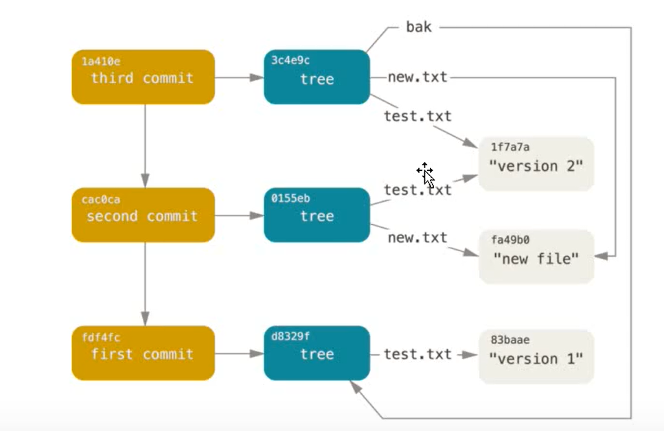

# Git

分布式的版本控制系统

客户端不只是提取最新版本的文件快照，而是把代码仓库完整地镜像下来，每一次的提取操作，实际上都是一次对代码仓库的完整备份

特点：
1.直接记录快照，而非差异比较
2.近乎所有操作都是本地执行
3.时刻保持数据的完整性
4.多数操作仅添加数据
5.文件的三种状态

# 初始化配置

检查已有配置

git config --list

配用户名与邮箱

git config --global user.name "beimeng"

git config --global user.email 1032916702@qq.com

# 初始化新仓库

git init

初始化，在当前目录下出现一个.git目录，所有的数据和资源都存放在这个目录中

# .git目录

## hooks
目录包含客户端和服务端的钩子脚本

## info
包含一个全局性排除文件

## logs
保存日志信息

## objects！
目录存储所有数据内容

## refs！
目录存储指向数据（分支）的数据对象指针

## config
文件包含项目特有的配置选项

## description
用来显示对仓库的描述信息

## Head！
文件指示目前被检出的分支

## index！
文件保存暂存区信息

# Git对象（文件快照）

key-value组成的键值对，
key是value的hash
键值对在GIt内部是一个blob类型


## 对一个对象进行简单的版本控制

### 创建一个文件并将其存入数据库

`echo "version 1" > test.txt`
`git hash-object -w test.txt`

### 向文件中写入新的内容，并将其存入数据库

`echo "version 2" > test.txt`
`git hash-object -w test.txt`

### 查看数据库内容

`git cat-file -p hash`

## Git对象的存储是工作区与版本库的交互

# 树对象（项目快照）

我们可以通过update-index; write-tree; read-tree等命令来构建树对象并塞入暂存区

## 将数据库Git对象引入暂存区

首次加入--add
`git update-index --add --cacheinfo 100644 hash test.txt`

## 查看暂存区

`git ls-files -s`

## 创建树对象(项目快照)存入数据库

`git write-tree`

##  将数据库中树对象引入暂存区

`git read-tree --prefix=bak hash`

## 创建新的嵌套树对象

`git write-tree`

# 提交对象（对树对象进行封装进行解释补充）

`echo "first commit" | git commit-tree 树对象hash`



# 高层命令（CRUD）

## Git操作最基本的流程

1.创建工作区，对工作区进行修改

2.`git add ./`
底层相当于 `git hash-object -w`  `git update-index`
相当于将工作区的文件转为Git对象存入数据库
再将它们从数据库引入暂存区

3.`git commit -m "注释内容"`
底层相当于`git write-tree` `git commit-tree`
相当于先创建树对象存入数据库
再创建提交对象存入数据库

## git init

初始化新仓库

## git add 路径

将文件转为Git对象存入数据库再引入暂存区

## git commit (-m "注释")

创建树对象以及提交对象存入数据库

-a 修改文件跳过暂存区直接提交

## git status

查看文件的状态

工作区下所有文件有两种状态： 已跟踪 与 未跟踪
已跟踪文件有三种状态：已修改 已暂存 已提交

## git diff (--cached/--staged)

git diff
当前哪些文件修改后还未暂存

git diff --cached
当前哪些文件已暂存还未提交

## git log (--oneline)

查看历史提交记录

## git rm 文件名

工作区删除文件且将修改存入暂存区

## git mv 原文件名 新文件名

将工作区对应文件重命名且将修改存入暂存区

# 高层命令（分支）

分支的本质就是一个提交对象
HEAD是一个指针，默认指向master分支 切换分支其实就是切换HEAD指向
每当有新的提交时，HEAD带着分支一起向前

## git branch 

显示分支列表

## git branch 分支名 commithash

在指定提交对象上创建分支

## git branch --merged

查看哪些分支已经合并到当前分支

## git checkout -b 分支名

创建并切换分支（当前commit对象）

## git branch -D 分支名

强制删除分支

## git log --oneline --decorate --graph --all

查看项目完整分支历史

## 切换分支的一些问题

1.切换分支时，如果当前分支有首次未暂存的修改或首次未提交的暂存，分支可以切换成功，但是会污染其他分支

2.切换分支改变三个位置：HEAD 暂存区 工作区

## git merge 分支名

快进合并（同一主线上）

典型合并（不同主线）

# Git存储

## git stash

git stash会将未完成的修改保存到一个栈上

## git stash apply 

栈顶应用但不出栈

## git stash list

查看存储

## git stash pop

栈顶应用且出栈

## git stash drop

出栈，若不小心没用应用直接出栈 git fsck 找回悬空的hash git stash apply hash

# 撤回修改

## 工作区修改撤回

git restore filename

## 暂存区修改撤回

git restore --staged filename

## 提交对象修改注释

git commit --amend
git commit --amend = git reset --soft HEAD~ + git commit

# 重置

## Reset三部曲

### git reset --soft HEAD~

只修改HEAD和分支指向
HEAD以及分支移到前一个提交对象
HEAD~可改为指定hash

### git reset [--mixed] HEAD~

修改HEAD和分支指向以及暂存区

### git reset --hard HEAD~ 危险！

修改HEAD和分支指向，暂存区及工作区

### git reset --hard 与 git checkout 区别

checkout：改变HEAD，暂存区，工作区，但是它对于工作区是安全的
--hard：改变HEAD，分支，暂存区，工作区，强制覆盖工作目录，可能会造成工作区文件丢失

## checkout

### git checkout hash

改变HEAD，暂存区，工作区

### git checkout --filename

只改变工作区

# 数据恢复

## git reflog

找到需要恢复的提交对象的hash，在那个对象上开新的分支

# TAG

Git可以给历史中某一个提交打上标签，以示重要，比较有代表性的是使用这个功能来标记发布节点

## 列出标签

### git tag

## 创建标签

Git使用两种主要类型的标签：轻量标签 与 附注标签

### git tag v1.0 commithash

轻量标签像是一个不会改变的分支，它只是一个特定提交的引用

## 查看标签

### git show tagname

## 删除标签

### git tag -d tagname

## 检出标签

### git checkout tagname

问题，通过checkout检出标签会出现HEAD与分支头部分离的情况，所以要在检出的提交对象创建分支git checkout -b 分支名

# Git + ESlint + husky

package.json
```
  "scripts": {
    "test": "echo \"Error: no test specified\" && exit 1",
    "eslint": "eslint ./",
    "eslint:create": "eslint --init"
  },
  "husky": {
    "hooks": {
      "pre-commit": "npm run eslint",
      "pre-push": "npm test"
    }
  }
```

或者
npx eslint --init
npx eslint 目录

# 远程仓库GitHub

## 团队协作

1.项目经理在GitHub初始化远程仓库

2.项目经理创建本地仓库
    git init （初始化本地仓库
    git remote add 别名 仓库地址 （连接远程仓库
    git config user.name（修改用户名邮箱
    git add ./
    git commit

3.项目经理推送本地仓库到远程仓库
    git push -u 别名 分支 （本地生成远程跟踪分支

4.项目邀请成员

5.成员克隆远程仓库
    git clone 仓库地址 （本地生成.git 默认为远程仓库配别名 origin，创建一个跟踪 origin/master 的 本地 master 分支

6.成员工作
    修改源码
    git add ./
    git commit
    git push -u 别名 分支 （本地生成远程跟踪分支

7.项目经理更新修改
    git fetch 别名（修改同步到远程跟踪分支上
    git merge 远程跟踪分支

## 本地分支 跟踪 远程跟踪分支

### 1.新建本地分支跟踪远程跟踪分支

git checkout -b 本地分支名 远程跟踪分支名
git checkout --track 远程跟踪分支名

### 2.在已有本地分支情况下

git branch -u 远程跟踪分支

跟踪之后可直接在本地分支下使用 
git push git pull 与远程库进行交互

git branch -vv 查看所有跟踪分支

## 删除远程分支

### git push origin --delete 远程分支名

### git remote prune origin --dry -run

列出远程分支删除后仍然存在的远程跟踪分支

### git remote prune origin

清除无用的远程跟踪分支

# pull request

# SSH

ssh-keygen -t rsa -C 邮箱
