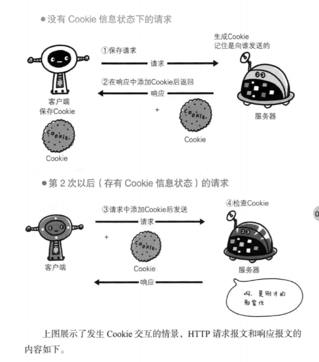

# TCP/IP通信传输流


# 没人能全面掌握互联网中的传输情况


# TCP协议三次握手


# DNS域名解析服务


# HTTP协议通信过程


# 告知服务器意图的HTTP方法

## GET


## POST 


## PUT


## HEAD


## DELETE


## OPTIONS


## TRACE


## CONNECT


# 使用COOKIE的状态管理





# Cookie Session 与 Token

## Cookie

cookie 是一个非常具体的东西，指的就是浏览器里面能永久存储的一种数据。跟服务器没啥关系，仅仅是浏览器实现的一种数据存储功能。
cookie由服务器生成，发送给浏览器，浏览器把cookie以KV形式存储到某个目录下的文本文件中，下一次请求同一网站时会把该cookie发送给服务器。由于cookie是存在客户端上的，所以浏览器加入了一些限制确保cookie不会被恶意使用，同时不会占据太多磁盘空间。所以每个域的cookie数量是有限制的。

客户端可以设置cookie的以下选项: expires, domain, path, secure(只有在https协议的网页中, 客户端设置secure类型cookie才能生效), 但无法设置httpOnly选项

服务端返回response header中有一项叫set-cookie, 是服务端专门用来设置cookie的;

一个set-cookie只能设置一个cookie, 当你想设置多个, 需要添加同样多的set-cookie
服务端可以设置cookie的所有选项: expires, domain, path, secure, HttpOnly


## Session

服务器要知道当前请求发给自己的是谁。为了做这种区分，服务器就是要给每个客户端分配不同的"身份标识"，然后客户端每次向服务器发请求的时候，都带上这个”身份标识“，服务器就知道这个请求来自于谁了。
至于客户端怎么保存这个”身份标识“，可以有很多方式，对于浏览器客户端，大家都采用cookie的方式。


1.用户向服务器发送用户名和密码
2.服务器验证通过后,在当前对话(session)里面保存相关数据,比如用户角色, 登陆时间等;
3.服务器向用户返回一个session_id, 写入用户的cookie
4.用户随后的每一次请求, 都会通过cookie, 将session_id传回服务器
5.服务端收到 session_id, 找到前期保存的数据, 由此得知用户的身份

### Session扩展性不好问题

扩展性不好，如何实现Session数据共享
A网站和B网站是同一家公司的关联服务。现在要求，用户只要在其中一个网站登录，再访问另一个网站就会自动登录，请问怎么实现？这个问题就是如何实现单点登录的问题
1.Nginx ip_hash 策略，服务端使用 Nginx 代理，每个请求按访问 IP 的 hash 分配，这样来自同一 IP 固定访问一个后台服务器，避免了在服务器 A 创建 Session，第二次分发到服务器 B 的现象。

2.Session复制：任何一个服务器上的 Session 发生改变（增删改），该节点会把这个 Session 的所有内容序列化，然后广播给所有其它节点。

3.共享Session：将Session Id 集中存储到一个地方，所有的机器都来访问这个地方的数据。这种方案的优点是架构清晰，缺点是工程量比较大。另外，持久层万一挂了，就会单点失败；

## Token


1.用户通过用户名和密码发送请求
2.程序验证
3.程序返回一个签名的token给客户端
4.客户端储存token, 并且每次用每次发送请求
5.服务端验证Token并返回数据

### JWT(JSON Web Token)

JSON Web Tokens由dot（.）分隔的三个部分组成，它们是：

Header（头部）
Payload（负载）
Signature（签名）
因此，JWT通常如下展示：

xxxxx.yyyyy.zzzz

#### Header（头部）

Header 是一个 JSON 对象
```
{
  "alg": "HS256", // 表示签名的算法，默认是 HMAC SHA256（写成 HS256）
  "typ": "JWT"  // 表示Token的类型，JWT 令牌统一写为JWT
}

```

#### Payload（负载）

Payload 部分也是一个 JSON 对象，用来存放实际需要传递的数据
JWT 默认是不加密的，任何人都可以读到，所以不要把秘密信息放在这个部分。
```
{
  // 7个官方字段
  "iss": "a.com", // issuer：签发人
  "exp": "1d", // expiration time： 过期时间
  "sub": "test", // subject: 主题
  "aud": "xxx", // audience： 受众
  "nbf": "xxx", // Not Before：生效时间
  "iat": "xxx", // Issued At： 签发时间
  "jti": "1111", // JWT ID：编号
  // 可以定义私有字段
  "name": "John Doe",
  "admin": true
}

```

#### Signature（签名）

Signature 是对前两部分的签名，防止数据被篡改。

首先，需要指定一个密钥(secret)。这个密钥只有服务器才知道，不能泄露给用户。然后，使用Header里面指定的签名算法（默认是 HMAC SHA256），按照下面的公式产生签名。

```
HMACSHA256(base64UrlEncode(header) + "." + base64UrlEncode(payload), secret)
```

算出签名后，把 Header、Payload、Signature 三个部分拼成一个字符串，每个部分之间用"点"（.）分隔，就可以返回给用户。
```
JWT = Base64(Header) + "." + Base64(Payload) + "." + $Signature
```

#### 如何保证安全

发送JWT要使用HTTPS；不使用HTTPS发送的时候，JWT里不要写入秘密数据
JWT的payload中要设置expire时间

#### 使用

客户端收到服务器返回的 JWT，可以储存在 Cookie 里面，也可以储存在 localStorage。此后，客户端每次与服务端通信，都要带上这个JWT。你可以把它放在Cookie里面自动发送，但是这样不能跨域，所以更好的做法是放在HTTP请求的头信息 Authorization 字段里面。

另一种做法是， 跨域的时候， JWT就放在POST请求的数据体里。

## 三者区别

### Cookie和Session的区别

1.存储位置不同： cookie数据存放在客户的浏览器上，session数据放在服务器上
2.隐私策略不同：cookie不是很安全， 别人可以分析存放在本地的cookie并进行cookie欺骗，考虑到安全应当使用session
3.session会在一定时间内保存在服务器上。当访问增多，就会比较占用你服务器的性能，考虑到减轻服务器性能方面，应当使用cookie
4.存储大小不同： 单个cookie保存的数据不能超过4k, 很多浏览器都限制一个站点最多保存20个cookie
一般建议： 将登陆信息等重要信息存放为session, 其他信息如果需要保留，可以放在cookie中

### Token和Session的区别

Session是一种HTTP储存机制， 为无状态的HTTP提供持久机制;
Token就是令牌， 比如你授权(登录)一个程序时，它就是个依据，判断你是否已经授权该软件；
Session和Token并不矛盾，作为身份认证Token安全性比Session好，因为每一个请求都有签名还能防止监听以及重放攻击，而Session就必须依赖链路层来保障通讯安全了。如上所说，如果你需要实现有状态的回话，仍然可以增加Session来在服务端保存一些状态。

# HTTP报文


## HTTP请求报文


## HTTP响应报文


## 响应报文状态码


# HTTP的缺点


# HTTPS

