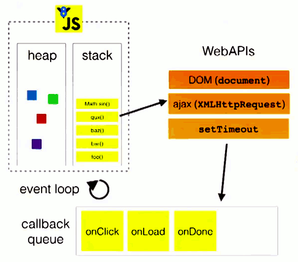
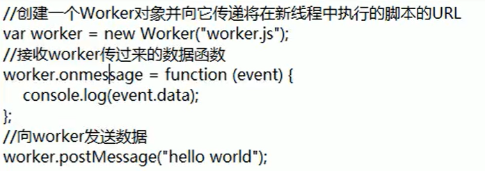
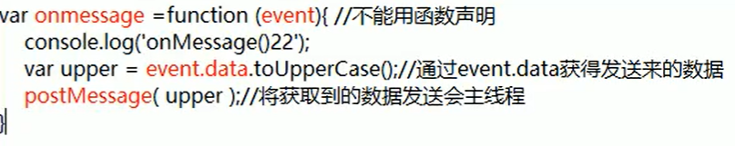

# 数据类型

## 基本类型

string number boolean undefined null

## 引用类型

object
function(特别对象，可执行)
array(特别对象，内部数据有序)

## 判断数据类型

### typeof

返回数据类型的字符串
不能判断null，返回object
不能判断array，返回object

`typeof a`

### instanceof(实例)

判断引用类型的具体类型

`a instanceof Object/Function/Array`

### ===

判断undefined和null

## undefined和null的区别？

undefined表示定义了未赋值
null表示定义了且赋值，值为null

## 什么时候给变量赋值为null？

初始赋值为null，表明将要赋值为对象

```
var a = null
a = []
a = null
```
最后赋值为null，将指向对象变为垃圾对象使其被回收，释放内存

## 严格区分数据类型和变量类型

变量的类型（变量内存值的类型）
基本类型：保存的值为基本类型
引用类型：保存的值为对象的地址


# 变量参数传递是值传递，值可能是基本类型也可能是对象的地址值

`var a = {age:12}
function changeAge (a) {
    a = {age:13}
}
changeAge(a)
console.log(a.age)`

```
var a = 3
function add (a) {
    a = a + 1
}
add(a)
console.log(a)
```

# JS引擎如何管理内存

## 内存的生命周期

1.分配内存，得到使用权
2.存储数据，可以进行反复操作
3.释放内存空间

## 释放内存

1.局部变量：函数执行完自动释放
2.对象：成为垃圾对象>垃圾回收器回收

# 对象

## 什么时候必须使用["属性名"]的方式读取或修改对象属性？

1.属性名包含特殊字符：- 空格
2.属性名为变量

# 函数

函数是n条语句的封装体，方便复用

## 回调函数

DOM事件回调函数
定时器回调函数
网络请求回调函数
生命周期回调函数

## IIFE

立即执行函数，匿名函数自调用

作用：隐藏实现，不污染全局作用域，JS模块化

## this

解析器在调用函数每次都会向函数内部传递进一个隐含的参数,这个隐含的参数就是this，this指向的是一个对象

这个对象我们称为函数执行的 上下文对象，根据函数的调用方式的不同，this会指向不同的对象

1.以函数的形式调用时，this永远都是window

2.以方法的形式调用时，this就是调用方法的那个对象

3.当以构造函数的形式调用时，this就是新创建的那个对象（实例）

4.使用call()l和apply()调用时，this是指定的那个对象

5.在事件的响应函数中，响应函数是给谁绑定的this就是谁

# 原型与原型链（实例对象的隐式原型指向其构造函数的显式原型）

## 函数的prototype属性

每个函数都有prototype属性，它默认指向一个Object实例对象（但Object不满足），即 原型对象
而 原型对象 中有一个属性为constructor（构造函数），它指向函数对象

给 原型对象 添加属性（一般都是方法）
作用：函数的所有实例对象自动拥有原型中的属性（方法）

## 显式原型与隐式原型

每个函数function都有一个prototype属性，即显示原型，在定义函数时自动添加

每个实例对象都有一个__proto__属性，即隐式原型，在创建对象时自动添加，隐式原型值为其对应构造函数的显示原型的值

## 原型链（隐式原型链）

访问一个实例对象的属性时
1.先在实例对象自身的属性中查找，找到返回
2.否则，沿着实例对象的__proto__向上查找，找到返回
3.否则，返回undefined
注意：
1.所有函数都是Function(包括Function本身)的实例
2.Object的原型对象是原型链的尽头

## 原型继承

构造函数的实例对象自动拥有构造函数原型对象的属性和方法

## 详解instanceof

A instanceof B 
如果B函数的显式原型对象在A对象的隐式原型链上，则返回true，否则返回false

# 变量声明提升

var 提前申明，但不赋值，执行到才赋值，执行之前访问为undefined

# 函数申明提升

function 提前申明，可直接调用

# 全局执行上下文

1.在执行全局代码前将window确定为全局执行上下文

2.对全局数据进行预解析
    var 定义的全局变量为undefined，添加为window的属性
    function声明的全局函数赋值，添加为window的方法
    this赋值为window
    
3.开始执行全局代码


# 函数执行上下文

1.在调用函数，准备执行函数体之前，创建对应的函数执行上下文对象

2.对局部数据进行预解析
    形参变量→赋值（实参）→添加为执行上下文的属性
    arguments→赋值（参数列表）→添加为执行上下文的属性
    var定义的局部变量→赋值undefined，添加为执行上下文的属性
    function声明的函数→赋值，添加为执行上下文的方法
    this→赋值

3.开始执行函数代码

```
var c = 1
function c(c){
    console.log(c)
    var c = 2
}
c(3)
```

# 执行上下文栈

1.在全局代码执行前，JS引擎就会创建一个栈来存储管理所有的执行上下文对象

2.在全局执行上下文（window）确定后，将其添加到栈中，进行压栈操作

3.在函数执行上下文创建后，将其添加到栈中，进行压栈操作

4.在当前函数执行完后，将栈顶对象移除，出栈

5.所有代码执行完后，栈中只剩下window

# 作用域与作用域链

## 作用域

代码段所在的区域，它是静态的，在编写代码时就确定了

分类：全局作用域，函数作用域，ES6块级作用域

作用：隔离变量，不同作用域下同名变量不会有冲突

# 作用域与执行上下文

区别1：
全局作用域之外，每个函数都会创建自己的作用域，作用域在函数定义时就已经确定了，而不是在函数调用时

全局执行上下文是在全局作用域确定之后，js代码马上执行前创建
函数执行上下文是在调用函数时，函数体代码执行前创建

区别2：
作用域是静态的，只要函数定义好就一直存在，且不会再变化
执行上下文是动态的，调用函数时创建，函数调用结束时执行上下文出栈，执行上下文释放

联系：
执行上下文从属于所在的作用域

# 闭包

## 如何产生闭包?

当嵌套的内部子函数引用了外部的父函数的变量（或函数），执行外部父函数就产生了闭包，外部函数执行几次，产生几个闭包

## 闭包到底是什么?

闭包是上文所说嵌套的内部子函数与其对外部函数变量或者函数的引用整体称为闭包

## 闭包的作用

1.使用函数内部的变量在函数执行完后，仍然存活在内存中（延长了局部变量的生命周期）
2.让函数外部可以操作（读写）到函数内部的数据（变量/函数）

## 闭包的缺点及解决：内存溢出与内存泄漏

及时释放嵌套内函数对象，使之成为垃圾对象被回收

```
function fun(n, o) {
    console.log(o)
    return {
        fun: function (m) {
            return fun(m, n)
        }
    }
}

var a = fun(0) //undefined
a.fun(1) //0
a.fun(2) //0
a.fun(3) //0

var b = fun(0).fun(1).fun(2).fun(3) // undefined 0 1 2

var c = fun(0).fun(1) // undefined 0
c.fun(2) //1
c.fun(3) //1
```

# 进程与线程

## 进程（process）

程序的一次执行，它占有一片独有的内存空间

## 线程（thread）

是进程内的一个独立执行单元
是程序执行的一个完整流程
是CPU的最小的调度单元

## 相关知识

应用程序必须运行在一个进程的某个线程上

一个进程中至少有一个运行的线程：主线程，进程启动后会自动创建

一个进程中也可以同时运行多个线程，我们就会说程序是多线程运行的

一个进程内的数据可以供其中的线程直接共享

多个进程之间的数据是不能直接共享的

线程池（thread pool）：保存多个线程对象的容器，实现线程对象的反复利用

## JS是单线程运行

但使用H5中的Web Workers可以多线程运行

## 浏览器是多线程运行的

# 浏览器内核

浏览器内核由多模块组成

## 主线程

### JS引擎线程

负责JS程序的编译和运行

### GUI 渲染线程

负责渲染浏览器界面，解析HTML，CSS，构建DOM树和RenderObject树，布局和绘制等。
当界面需要重绘（Repaint）或由于某种操作引发回流(reflow)时，该线程就会执行
注意，GUI渲染线程与JS引擎线程是互斥的，当JS引擎执行时GUI线程会被挂起（相当于被冻结了），GUI更新会被保存在一个队列中等到JS引擎空闲时立即被执行。

### GUI 渲染线程 与 JavaScript引擎线程互斥！
由于JavaScript是可操纵DOM的，如果在修改这些元素属性同时渲染界面（即JavaScript线程和UI线程同时运行），那么渲染线程前后获得的元素数据就可能不一致了。因此为了防止渲染出现不可预期的结果，浏览器设置GUI渲染线程与JavaScript引擎为互斥的关系，当JavaScript引擎执行时GUI线程会被挂起，GUI更新会被保存在一个队列中等到引擎线程空闲时立即被执行。这也是为什么<script>标签要放到body标签的最底部。

## 分线程

### 定时器线程

负责定时器的管理

### DOM事件响应线程

负责DOM事件的管理

### 网络请求线程

如Ajax请求


# JS是单线程执行的

代码的分类：初始代码和回调代码

## JS引擎执行代码的基本流程

先执行初始化代码，包含一些特别的代码如：设置定时器，绑定事件监听，发送AJAX请求

后面在某个时刻才会执行回调代码

# 事件循环模型



# H5 Web Workers多线程

H5规范提供了JS分线程的实现，取名为Web Workers
我们可以将一些大计算量的代码交由Web Workers运行而不冻结用户界面
但是子线程完全受主线程控制，且不得操作DOM，worker的全局对象不是window
所以这个新标准并没有改变JavaScript单线程的本质
不能跨域
不是所有浏览器都支持

主线程


子线程
