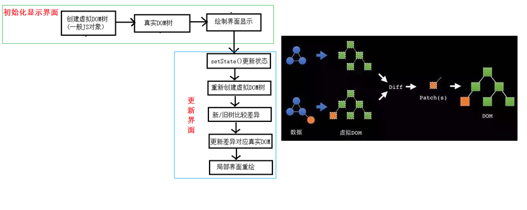

# React的特点

1.声明式编码
2.组件化编码
3.支持客户端，服务端渲染
4.高效
    原因：
    1.不直接操作DOM，虚拟DOM
    2.DOM diff算法 最小化页面重绘
5.单向数据流

# React JSX

## 虚拟DOM

1.React提供了一些API来创建一种“特别”的一般js对象
`const vDOM = React.createElement('h1', {id:'myTitle'}, 'hello world')`
2.虚拟DOM对象最终都会被React转换成真实的DOM
3.我们编码时只需要操作React的虚拟DOM相关数据，React会转换成真实的DOM变化而更新界面

## JSX

1.全称 JavaScript XML
2..React定义的一种类似于XML的JS扩展语法：XML + JS
3.作用：用来创建React虚拟DOM对象
`const vDOM = <h1>hello world</h1>`
    注意：不是字符串也并不是HTML/XML标签
    它最终产生的就是一个JS对象
4.标签名任意
5.标签属性任意
6.基本语法规则
    遇到 < 开头的代码，以标签语法解析：HTML同名标签转换为HTML同名元素，其他标签需要特别解析
    遇到 { 开头代码，以JS语法解析：标签中的JS代码必须用{}包含
7.babel.js作用
    浏览器不能直接解析JSX代码，需要babel转译为纯JS代码
    只要用了JSX，都要加上type='text/babel'，声明需要babel来处理

## 渲染虚拟DOM

`ReactDOM.render(virtualDOM, containerDOM)`
将虚拟DOM元素渲染到页面中的真实容器DOM中

# React面向组件编程

## 什么是组件

用来实现特定局部功能效果的代码集合（HTML/CSS/JS）

## 组件的定义与使用

```
<body>
    <div id="test1"></div>
    <div id="test2"></div>
    <script src="../js/react.development.js"></script>
    <script src="../js/react-dom.development.js"></script>
    <script src="../js/babel.min.js"></script>
    <script type="text/babel">
        /*方式1：工厂函数组件（简单组件：没有状态的组件）*/
        function MyComponents1(props) {
            return <h1>工厂函数组件（简单组件）{props.name}</h1>
        }
        ReactDOM.render(<MyComponents1 />, document.getElementById('test1'))

        /*方式2：ES6类组件（复杂组件）*/
        class MyComponents2 extends React.Component {
            render() {
                return <h1>ES6类组件（复杂组件）</h1>
            }
        }
        ReactDOM.render(<MyComponents2 />, document.getElementById('test2'))
    </script>
</body>
```
## 注意

1.组件名必须首字母大写
2.虚拟DOM元素只能有一个根元素
3.虚拟DOM元素必须有结束标签

## render()渲染组件标签的基本流程

1.React内部会创建组件实例对象
2.得到包含的虚拟DOM并解析为真实DOM
3.插入到指定的页面元素内部

## 组件三大属性

### state（状态）

state是组件对象最重要的属性，值是对象（可以包含多个数据）

组件被称为状态机，通过更新组件的state来更新对应的页面显示（重新渲染组件）

```
<body>
    <div id="test"></div>
    <script src="../js/react.development.js"></script>
    <script src="../js/react-dom.development.js"></script>
    <script src="../js/babel.min.js"></script>
    <script type="text/babel">
    class Love extends React.Component {
        constructor(props) {
            super(props)
            // 初始化状态
            this.state = {
                isLove: true
            }
            // 将新增方法强制绑定为组件对象
            this.handleClick = this.handleClick.bind(this)
        }
        // 新增方法this默认不是组件对象，而是null
        handleClick() {
            // 得到状态并取反
            const isLove = !this.state.isLove
            // 更新状态
            this.setState({isLove})
        }
        // 重写组件类方法
        render() {
            // 读取状态
            const {isLove} = this.state
            return <h1 onClick={this.handleClick}>{isLove?"我爱你":"我不爱你"}</h1>
        }
    }
    ReactDOM.render(<Love/>, document.getElementById('test'))
    </script>
</body>
```

### props（标签属性）

每个组件对象都会有props(properties)属性
组件标签的所有属性都保存在props中

通过标签属性从组件外向组件内传递变化的数据
注意：所有 React 组件都必须像纯函数一样保护它们的 props 不被更改。

```
<body>
    <div id="test"></div>
    <script src="../js/react.development.js"></script>
    <script src="../js/react-dom.development.js"></script>
    <script src="../js/prop-types.js"></script>
    <script src="../js/babel.min.js"></script>
    <script type="text/babel">
        // 定义组件类
        class Person extends React.Component {
            render() {
                console.log(this)
                return (
                    <ul>
                        <li>姓名：{this.props.name}</li>
                        <li>性别：{this.props.sex}</li>
                        <li>年龄：{this.props.age}</li>
                    </ul>
                )
            }
        }
        // 对标签属性进行限制
        Person.propTypes = {
            name: PropTypes.string.isRequired,
            sex: PropTypes.string,
            age: PropTypes.number,
        }
        // 指定属性默认值
        Person.defaultProps = {
            name: 'JACK',
            sex: '男',
            age: 20
        }
        // 渲染组件标签
        const person = {
            name: 'Helen'
        }
        ReactDOM.render(<Person {...person}/>, document.getElementById('test'))
    </script>
</body>
```

### state与props的区别

state：组件自身内部可变化的数据
props：从组件外部向组件内部传递数据，组件内部只读不修改

### refs（元素标识）

组件内的标签都可以定义ref属性来标识自己

`<input type='text' ref=(input => this.msginput = input)` 
回调函数在组件初始化渲染完成或卸载时自动调用
在组件中可以通过this.msginput来得到对应的真实DOM元素
作用：通过ref获取组件内容特定标签对象，进行读取其相关数据

```
<body>
    <div id="test"></div>
    <script src="../js/react.development.js"></script>
    <script src="../js/react-dom.development.js"></script>
    <script src="../js/babel.min.js"></script>
    <script type="text/babel">
        // 定义组件
        class MyComponent extends React.Component {
            constructor(props) {
                super(props)
                // 自定义函数this强制绑定为组件对象
                this.handleClick = this.handleClick.bind(this)
            }
            // 自定义方法中的this默认为null
            handleClick() {
                alert(this.msgInput.value)
            }
            handleBlur(e) {
                alert(e.target.value)
            }
            render() {
                return (
                    <div>
                        <input type="text" ref={input => this.msgInput = input}/> 
                        <button onClick={this.handleClick}>提示已输入内容</button> 
                        <input type="text" placeholder='失去焦点提示内容' onBlur={this.handleBlur}/>  
                    </div>
                )
            }
        }
        ReactDOM.render(<MyComponent/>, document.getElementById('test'))
    </script>
</body>
```

## 组件的组合

### 功能界面的组件化编码流程（无比重要）

1.拆分组件：拆分界面，抽取组件

2.实现静态组件：使用组件实现静态页面效果

3.实现动态组件
    1.动态显示初始化数据
    2.交互功能（从绑定事件监听开始）

问题1：数据保存在哪个组件内？
    看数据是某个组件需要（给它）
    还是某些组件需要（给共同的父组件）

问题2：需要在子组件中改变父组件的状态
    子组件不能直接改变父组件的状态
    状态在哪个组件，更新状态的行为就应该在哪个组件
    解决：父组件定义函数，传递给子组件，子组件调用

```
<body>
  <div id="example"></div>
  <script type="text/javascript" src="../js/react.development.js"></script>
  <script type="text/javascript" src="../js/react-dom.development.js"></script>
  <script type="text/javascript" src="../js/prop-types.js"></script>
  <script type="text/javascript" src="../js/babel.min.js"></script>
  <script type="text/babel">
    /*
    1)拆分组件: 拆分界面,抽取组件
    2)实现静态组件: 使用组件实现静态页面效果
    3)实现动态组件
        ① 动态显示初始化数据
        ② 交互功能(从绑定事件监听开始)
     */
    // 应用组件
    class App extends React.Component {
      constructor (props) {
        super(props)
        // 初始化状态
        this.state = {
          todos: ['吃饭', '睡觉', '打豆豆']
        }
        this.add = this.add.bind(this)
      }
      add (todo) {
        const {todos} = this.state
        todos.unshift(todo)
        //更新状态
        this.setState({todos})
      }
      render () {
        const {todos} = this.state
        return (
          <div>
            <TodoAdd add={this.add} count={todos.length} />
            <TodoList todos={todos} />
          </div>
        )
      }
    }

    // 添加todo组件
    class TodoAdd extends React.Component {
      constructor (props) {
        super(props)
        this.addTodo = this.addTodo.bind(this)
      }
      addTodo () {
        // 读取输入数据
        const text = this.input.value.trim()
        // 查检
        if(!text) {
          return
        }
        // 保存到todos
        this.props.add(text)
        // 清除输入
        this.input.value = ''
      }
      render () {
        return (
          <div>
            <h2>Simple TODO List</h2>
            <input type="text" ref={input => this.input=input}/>
            <button onClick={this.addTodo}>Add #{this.props.count}</button>
          </div>
        )
      }
    }
    TodoAdd.propTypes = {
      add: PropTypes.func.isRequired,
      count: PropTypes.number.isRequired
    }

    // todo列表组件
    class TodoList extends React.Component {
      render () {
        const {todos} = this.props
        return (
          <ul>
            {
              todos.map((todo, index) => <li key={index}>{todo}</li>)
            }
          </ul>
        )
      }
    }
    TodoList.propTypes = {
      todos: PropTypes.array.isRequired
    }

    // 渲染应用组件标签
    ReactDOM.render(<App />, document.getElementById('example'))

  </script>
</body>
```

### 收集表单数据

问题：在React应用中，如何收集表单输入数据

包含表单的组件分类：
1.受控组件：表单输入数据能自动收集成状态
2.非受控组件：需要时才手动读取表单输入框中的数据
```
<div id="example"></div>
<script type="text/javascript" src="../js/react.development.js"></script>
<script type="text/javascript" src="../js/react-dom.development.js"></script>
<script type="text/javascript" src="../js/babel.min.js"></script>
<script type="text/babel">
  class LoginForm extends React.Component {
    constructor(props) {
      super(props)
      this.state = {
        username: ''
      }
      this.handleSubmit = this.handleSubmit.bind(this)
      this.handleChange = this.handleChange.bind(this)
    }

    handleChange(event) {
      this.setState({username: event.target.value})
    }

    handleSubmit(event) {
      alert(`准备提交的用户名为: ${this.state.username}, 密码:${this.pwdInput.value}`)

      // 阻止事件的默认行为: 提交表单
      event.preventDefault()
    }
    render () {

      return (
        <form onSubmit={this.handleSubmit} action="/test">
          <label>
            用户名:
            <input type="text" value={this.state.username} onChange={this.handleChange} />
          </label>&nbsp;
          <label>
            密码:
            <input type="password" ref={(input) => this.pwdInput = input} />
          </label>&nbsp;
          <input type="submit" value="登陆" />
        </form>
      )
    }
  }
  
  ReactDOM.render(<LoginForm />, document.getElementById('example'))
</script>
```

## 组件生命周期

### 理解

1.组件对象从创建到死亡它会经历特定的生命周期阶段
2.React组件对象包含一系列的钩子函数（生命周期回调函数），在生命周期特定时刻回调
3.我们在定义组件时，可以重写特定的生命周期回调函数，做特定的工作

### 生命周期流程图


### 生命周期详述

1.组件的三个生命周期状态：
    Mount：挂载，插入真实DOM
    Update：被重新渲染
    Unmount：解除挂载，被移出真实DOM

2.React为每个状态都提供了钩子函数
    componentWillMount()
    componentDidMount()
    componentWillUpdate()
    componentDidUpdate()
    componentWillUnmount()

3.生命周期流程

第一阶段：第一次初始化渲染显示:ReactDOM.render()
    constructor():创建对象初始化state
    componentWillMount():将要挂载回调
    render():虚拟DOM挂载回调
    componentDidMount:已经挂载

第二阶段：.每次更新state:this.setState()
    componentWillUpdate():将要更新回调
    render():更新（重新渲染）
    componentDidUpdate():已经更新回调

第三阶段：ReactDOM.unmountComponentAtNode(containerDom)
    componentWillUnmount():组件解除挂载前回调

### 重要的钩子

1.render():初始化渲染以及更新渲染调用
2.componentDidMount():开启监听，发送Ajax请求
3.componentWillUnmount:做一些收尾工作，如：清除定时器
4.componentWillReceiveProps()

```
<div id="example"></div>

<script type="text/javascript" src="../js/react.development.js"></script>
<script type="text/javascript" src="../js/react-dom.development.js"></script>
<script type="text/javascript" src="../js/babel.min.js"></script>
<script type="text/babel">
  /*
  需求: 自定义组件
    1. 让指定的文本做显示/隐藏的动画
    2. 切换时间为2S
    3. 点击按钮从界面中移除组件界面
   */
  class Fade extends React.Component {

    constructor (props) {
      super(props)
      console.log('constructor(): 创建组件对象')
      this.state = {
        opacity: 1
      }
      this.removeComponent = this.removeComponent.bind(this)
    }

    componentWillMount () {
      console.log('componentWillMount(): 初始化将要挂载')
    }

    componentDidMount () {// 在此方法中启动定时器/绑定监听/发送ajax请求
      console.log('componentDidMount(): 初始化已经挂载')
      // 保存到当前组件对象中
      this.intervalId = setInterval(function () {
        console.log('--------')
        // 得到当前opacity
        let {opacity} = this.state
        // 更新opacity
        opacity -= 0.1
        if(opacity<=0) {
          opacity = 1
        }
        // 更新状态
        this.setState({opacity})
      }.bind(this), 200)
    }

    componentWillUpdate () {
      console.log('componentWillUpdate(): 将要更新')
    }
    componentDidUpdate () {
      console.log('componentDidUpdate(): 已经更新')
    }

    componentWillUnmount () {// 清除定时器/解除监听
      console.log('componentWillUnmount(): 将要被移除')
      clearInterval(this.intervalId)
    }

    removeComponent () {
      ReactDOM.unmountComponentAtNode(document.getElementById('example'))
    }

    render() {
      console.log('render() 渲染组件')
      return (
        <div>
          <h2 style={{opacity:this.state.opacity}}>{this.props.content}</h2>
          <button onClick={this.removeComponent}>不活了</button>
        </div>
      )
    }
  }
  ReactDOM.render(<Fade content="react学不会, 怎么办?"/>, document.getElementById('example'))
</script>
```

# 虚拟DOM与DOM diff 算法



# React脚手架

```
npm i -g create-react-app 
create-react-app react_demo
cd react_demo
npm start
```

# React网络请求

## axios

```
1) GET 请求
axios.get('/user?ID=12345')
    .then(function (response) {
        console.log(response);
    })
    .catch(function (error) {
        console.log(error);
    });
axios.get('/user', {
    params: {
        ID: 12345
    }
})
    .then(function (response) {
        console.log(response);
    })
    .catch(function (error) {
        console.log(error);
    });

2) POST 请求
axios.post('/user', {
    firstName: 'Fred',
    lastName: 'Flintstone' 
})
    .then(function (response) {
        console.log(response);
    })
    .catch(function (error) {
        console.log(error);
    });
```

## fetch

```
1) GET 请求
fetch(url)
    .then(function(response) {
        return response.json()
    })
    .then(function(data) {
        console.log(data)
    })
    .catch(function(e) {
        console.log(e)
    });

2) POST 请求
fetch(url, {method: "POST", body: JSON.stringify(data), })
    .then(function(data) {
        console.log(data)
    })
    .catch(function(e) {
        console.log(e)
    })
```

# 组件间通信

## 方式一：通过props传递

1.共同的数据放在父组件上，特有的数据放在自己组件内部state

2.通过props可以传递一般数据和函数数据，只能一层一层传递

## 方式二：使用消息订阅subscribe与发布publish机制

1.工具库：PubSubJS

2.npm i pubsub-js

3.
import PubSub from 'pubsub-js' //引入
PubSub.subscribe('delete', function(msg, data){ }); //订阅
PubSub.publish('delete', data) //发布消息

## 方式三：redux

# react-router4

## react-router理解

1.react的一个插件库

2.专门用来实现一个SPA应用

3.基于React的项目基本都会用到此库

## SPA理解

1.单页Web应用（single page web application, SPA）

2.整个应用只有一个完整的页面

3.点击页面中的链接不会刷新页面，本身也不会向服务器发请求

4.当点击链接时，只会做页面的局部更新

5.数据都需要通过ajax请求获取，并在前端异步展现

## 路由的理解

1.什么是路由？
    a.一个路由就是一个映射关系（key:value）
    b.key是路由路径，value可能是function/component

2.路由分类
    a.后台路由：node服务器路由，value是function，用来处理客户端提交的请求并返回一个响应数据
    b.前台路由：浏览器端路由，value是component，当请求的是路由path时，浏览器端没有发送http请求，单界面会更新显示对应的组件

3.后台路由
    a.注册路由：router.get(path,(req, res) => {})
    b.当node接收到一个请求时，根据请求路径找到匹配的路由，调用路由中的函数来处理请求，返回响应数据

4.前台路由
    a.注册路由：`<Route path='/about' component={About}>`
    b.当浏览器的hash变为#about时，当前路由组件就会变为About组件

## react-router使用

`npm i react-router-dom@4`

## react-router相关API

```
1) <BrowserRouter>
2) <HashRouter>
3) <Route>
4) <Redirect>
5) <Link>
6) <NavLink>
7) <Switch>
```

其他
1) props.history 对象
history.push(): 添加一个新的历史记录
history.replace(): 用一个新的历史记录替换当前的记录
history.goBack(): 回退到上一个历史记录
history.goForword(): 前进到下一个历史记录
history.listen(function(location){}): 监视历史记录的变化
2) props.match 对象
3) withRouter 函数

# react-ui

## Ant-Design

### 搭建antd-mobile的基本开发环境

1.npm install antd --save

# redux

## redux是什么?

1.redux是一个独立专门用于做管理状态的JS库

2.它可以用在react，angular，vue项目中，但基本与react配合使用

3.作用：集中式管理react应用中多个组件共享的状态

## redux工作流程


## redux核心API

### 1.createStore()

作用：创建包含指定reducer的store对象

### 2.store对象

作用：redux库最核心的管理对象
它内部维护着：state与reducer函数

核心方法：getState() dispatch(action) subscribe(listener)

### 3.applyMiddleware()

作用：基于redux的中间件

### 4.combineReducers()

作用：合并多个reducer函数

## redux的三个核心概念

### 1.action

标识要执行行为的对象
包含两个方面的属性
    type：标识属性，值为字符串，唯一，必要属性
    data：数据属性，值类型任意，可选属性

Action Creator(创建Action的工厂函数)

### 2.reducer

根据老的state和action，产生新的state纯函数

注意：返回一个新的状态，不修改原来的状态

### 3.store

将state, action与reducer联系在一起的对象

getState()：得到state

dispatch(action)：分发action，触发reducer调用，产生新的state

subscribe(listener)：注册监听，当产生新的state时，自动调用

## 问题

1.redux与react组件的代码高度耦合
2.编码不够简洁

## react-redux

### 理解

1.一个react插件库
2.专门用来简化react应用中使用redux

### 所有组件分为两大类

1.UI组件

只负责UI的呈现，不带有任何业务逻辑
通过props接收数据（一般数据和函数）
不适用任何Redux的API
一般保存在components文件夹下

2.容器组件

负责管理数据和业务逻辑，不负责UI的呈现
使用Redux的API
一般保存在containers文件夹下

### 相关API

#### Provider

让所有组件都能得到state数据
```
<Provider store={store}>
<App />
</Provider>
```

#### connect()

用于包装UI组件生成容器组件

例：
`connect(state => ({count: state}),{increment, decrement})(UI组件)`

### 问题

1.redux默认是不能进行异步处理的（ajax，定时器）

## redux异步编程（使用异步中间件）

npm i redux-thunk

### store.js

```
import {createStore, applyMiddleware} from 'redux'
import thunk from 'redux-thunk'
// 根据 counter 函数创建 store 对象
const store = createStore(
reducer,
applyMiddleware(thunk) // 应用上异步中间件
)
```

### actions.js

```
// 异步action creator（返回一个函数）
export const ActionCreator = number => {
return dispatch => {
setTimeout(() => {
dispatch(increment(number))
}, 1000)
}
}
```

## redux-devtools

安装chrome插件redux-devtools

下载工具依赖包

npm i redux-devtools-extension

```
import { composeWithDevTools } from 'redux-devtools-extension'
const store = createStore(
counter,
composeWithDevTools(applyMiddleware(thunk))
)
```
