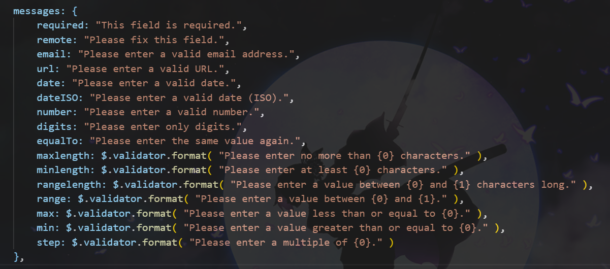

# jQuery

jQuery全称为 JavaScript Query 即JavaScript查询

# 伪数组的概念

伪数组是object对象
具有length属性
数值有索引属性
没有数组的方法


# 初识jQuery

## jQuery是什么？

jQuery是一个优秀的JS函数库
Write Less,Do More!!!
封装简化DOM操作（CRUD增删改查）/ Ajax

## 为什么要使用jQuery?

HTML元素选取和操作，CSS操作，HTML事件处理，JS动画效果，链式调用，读写合一，浏览器兼容，易扩展插件，AJAX封装....

重点：链式调用，读写合一，隐式遍历（隐式迭代）

## 使用jQuery

引入jQuery：本地服务器引入，远程CDN引入
使用jQuery：jQuery核心函数（$ / jQuery），jQuery核心对象（执行$()返回的对象）

# jQuery两把利器

jQuery库向外暴露的是jQuery函数
执行核心函数返回核心对象

## jQuery核心函数

作为函数调用：$(param)
1.参数为函数：当DOM加载完成后，执行此回调函数
2.参数为选择器字符串：查找所有匹配的标签，并将它们封装成jQuery对象
3.参数为DOM对象：将DOM对象封装成jQuery对象
4.参数为HTML标签字符串（用的少）：创建标签对象并封装成jQuery对象

## jQuery核心对象

jQuery对象是一个包含所有匹配的任意多个DOM元素的伪数组对象即执行jQuery核心函数返回的对象
jQuery对象内部包含的是DOM元素对象的伪数组
jQuery对象拥有很多有用的属性和方法

### jQuery对象的基本行为

#### size()/length

对象包含的DOM元素的个数

`$("botton").size() / $("botton").length`

#### [index]/get(index)

得到对应位置的DOM元素

`$("botton").[index].innerHTML / $("botton").get(index).innerHTML`

#### each()

遍历包含的所有DOM元素

```
$("botton").each(function(index, domEle) {
    this = domEle
})
```

#### index()

得到在所有兄弟元素中的下标

`$("btn3").index()`

# 使用jQuery核心函数和对象

## jQuery选择器

### 基本选择器

id选择器 类选择器 元素选择器 通配选择器 并集选择器 交集选择器
### 层次选择器

子元素选择器 后代选择器 兄弟选择器 

### 过滤选择器

注意是逐步过滤！多个过滤选择器不是同步执行的而是依次

选中第一个div
`$("div:first")`

选中最后一个div
`$("div:last")`

选中class不是box的div
`$("div:not(.box)")`

选中第二个div
`$("div:eq(1)")`

选中除第二个和第三个div
`$("div:gt(0):lt(2)")`


选中内容为ABC的div
`$("div:contains:('ABC')")`

选中隐藏的div
`$("div:hidden")`
:visible可见

选中有id属性的div
`$("div[id]")`

选中title属性为hello的div
`$("div[title=hello]")`
属性值可以加引号也可以不加

### 表单选择器

:input :text :password :radio :checkbox :submit....
表单对象属性：
:enabled :disabled :checked :selected

## 工具方法

### $.each()

遍历数组和对象中的数据

### $.trim()

去除字符串两边的空格

### $.isArray()

判断是否是数组

### $.isFunction()

判断是否是函数

### $.parseJSON()

解析json字符串为js对象/数组

## jQuery属性

读取第一个div的title属性
`$("div:first").attr("title")`

给所有的div设置name属性（value为ABC）
`$("div").attr("name", "ABC")`
注意属性会覆盖

移除所有div的title属性
`$("div".removeAttr("title"))`

点击全选实现全选
```
var $checkboxs = $(":checkbox")
$("bottom:first").click(function (){
    $checkboxs.prop("checked", true)
})
```

点击全不选实现全不选
```
var $checkboxs = $(":checkbox")
$("bottom:last").click(function (){
    $checkboxs.prop("checked", false)
})
```

给所有div设置class="ABC"
`$("div").addClass("ABC")`

移除所有div的class="ABC"
`$("div").removeClass("ABC")`

找到最后一个li的标签文本
`$("li:last").html()`

找到第一个li标签设置标签体为`<h1>mmm</h1>`
`$("li:first").html("<h1>mmm</h1>")`

获取输入框中的value值
`$(":text").val()`

将输入框的值设置为ABC
`$(":text").val("ABC")`

## jQuery CSS

### CSS
获取第一个P标签的颜色
`$("p:first").css("color")`

设置所有P标签的文本颜色为red
`$("p").css("color", "red")`

设置第二个P标签的字体颜色blue，背景green，宽300px
```
$("p:eq(1)").css({
    color:blue,
    background:green,
    width:300,//可以不加px
})
```

### 位置

#### offset()

获取匹配元素在当前视口的相对偏移
返回的对象包含两个整型属性：top和left，此方法只对可见元素有效

获取div1相对于页面左上角的位置

```
var offset = $("div1").offset()
console.log(offset.left, offset.right)
```

设置div1相对于页面左上角的位置top:20px,left:50px
```
$("div1").offset({top:20,left:50})

```

#### position()

获取匹配元素相对于父元素左上角的相对偏移
返回的对象包含两个整型属性：top和left，此方法只对可见元素有效

获取获取div1相对于父元素左上角的位置

```
var position = $("div1").position()
console.log(position.left, position.right)
```

#### scrollTop()

获取/设置匹配元素相对滚动条顶部的偏移。
此方法对可见和隐藏元素均有效。

得到div或页面相对滚动条顶部的偏移
`$("div").scrollTop()`
`$(document).scrollTop()`

设置div或页面相对滚动条顶部的偏移为200px
`$("div").scrollTop(200)`
`$(document).scrollTop(200)`

### 尺寸

#### 内容尺寸

height():height

width():width

#### 内部尺寸

innerHeight():height+padding

innerWidth():width+padding

####  外部尺寸

outerHeight(false/true):如果是false：height+padding+border；如果为true，加上margin

outerWidth(false/true):如果是false：width+padding+border；如果为true，加上margin

## jQuery对象过滤

### first()
### last()
### eq(index)
### filter()
选中title属性为hello的div
`$("div").filter("[title=hello]")`

### not()
选中title属性不为hello的div
`$("div").not("[title=hello]")`

### has()

保留包含特定后代的元素，去掉那些不含有指定后代的元素。
选中含有span子元素的div
`$("div").has("span")`

## jQuery对象查找

在已经匹配到的元素集合中根据选择器查找父子兄弟标签

### children()
子标签中找

### find()
后代标签中找

### parent()
父标签

### prevAll()
前面所有兄弟标签

### nextAll()
后面所有的兄弟标签

### siblings()
前后所有的兄弟标签

## jQuery文档增删改

### 添加替换元素

#### append(content)

向当前匹配的所有元素内部的最后添加指定内容

#### prepend(content)

向当前匹配的所有元素内部的最前面添加指定内容

#### before(content)

将指定内容插入到当前所有匹配元素的前面

#### after(content)

将指定内容插入到当前所有匹配元素的后面

#### replaceWith(content)

将指定内容替换所有匹配的标签节点

### 删除元素

#### empty()

删除所有匹配的子元素

#### remove()

删除所有匹配的元素

## jQuery事件处理

### 事件的绑定（2种）

eventName(function(){})
绑定对应事件名的监听，例如$("#box").click(function(){})

on(eventName, function(){})
通用的绑定事件监听，例如$("#box").on("click", function(){})

优缺点：
eventName：编码方便，但有的事件没有对应的方法
on：编码不方便，可以添加多个监听，且更通用

### 事件解绑

off(eventName)

### 事件的坐标

event.clientX, event.clientY 相对于视口的左上角
event.pageX, event.pageY 相对于页面的左上角
event.offsetX, event.offsetY 相对于事件元素的左上角

### 事件的相关处理

停止事件冒泡：event.stopPropagation()
阻止事件默认行为：event.preventDefault()

### 区别mouseover与mouseenter

mouseover：在移入子元素时也会触发，对应mouseout
mouseenter：只有在移入当前元素时才会触发，对应mouseleave
hover()使用的是mouseenter()和mouseleave()

### 事件委托/委派/代理

将统一的事件绑定给元素的共同祖先元素，这样当后代元素上的事件被触发时，会一直冒泡到祖先元素，从而通过祖先元素的响应函数来处理事件

事件委派是利用了冒泡，通过委派可以减少事件绑定的次数，提高程序的性能

但是注意祖先元素不会直接处理事件，而是根据event.target得到发生事件的后代元素，通过这个后代元素调用回调函数

jQuery事件委派API
设置事件委派
`$(parentSelector).delegate(childrenSelector, eventName, callback)`
移除事件委派
`$(parentSelector).undelegate(eventName)`

## jQuery效果

### 淡入淡出

不改变元素的透明度来实现淡入淡出

fadeIn([speed],[easing],[fn])：带动画的显示
speed:三种预定速度之一的字符串("slow","normal", or "fast")或表示动画时长的毫秒数值(如：1000)

easing:(Optional) 用来指定切换效果，默认是"swing"，可用参数"linear"

fn:在动画完成时执行的函数，每个元素执行一次。

fadeOut()：带动画的隐藏

fadeToggle()：带动画切换显示/隐藏

### 滑动动画

不断改变元素的高度实现

slideDown()：带动画的展开
slideUp()：带动画的收缩
slideToggle()：带动画的切换展开/收缩

### 显示隐藏

默认没有动画
如果有动画则是通过改变元素的透明度元素宽高从左上角展开

show()：（不）带动画的显示
hide()：（不）带动画的隐藏
toggle()：（不）带动画的切换显示/隐藏

### 自定义动画

animate(params,[speed],[easing],[fn])

params:一组包含作为动画属性和终值的样式属性和及其值的集合
speed:三种预定速度之一的字符串("slow","normal", or "fast")或表示动画时长的毫秒数值(如：1000)
easing:要使用的擦除效果的名称(需要插件支持).默认jQuery提供"linear" 和 "swing".
fn:在动画完成时执行的函数，每个元素执行一次。

```
// 在一个动画中同时应用三种类型的效果
$("#go").click(function(){
  $("#block").animate({ 
    width: "90%",
    height: "100%", 
    fontSize: "10em", 
    borderWidth: 10
  }, 1000 );
});

//移动指定的距离
$("#go").click(function(){
  $("#block").animate({ 
    top:"+=100",
    left:"+=100"
  }, 1000 );
});
```

stop([queue],[clearQueue],[jumpToEnd])

queue:用来停止动画的队列名称
clearQueue:如果设置成true，则清空队列。可以立即结束动画。
jumpToEnd:如果设置成true，则完成队列。可以立即完成动画。

## 多库共存

问题：如果有两个库都有$，就存在冲突
解决方法：jQuery库可以释放$的使用权，让另一个库可以正常使用，此时jQuery库只能用jQuery了
API：jQuery.noConflict()

## 区别onload与ready

window.onload与$(document).ready()的区别

window.onload
包含页面的图片加载完成后才会回调（晚）
只有一个监听回调，后者会覆盖前者

$(document).ready()
等同于：$(function(){})
页面加载完就回调（早）
可以有多个监听回调

# 自定义jQuery扩展

扩展jQuery的工具方法
$.extend(object)

扩展jQuery对象的方法
$.fn.extend(object)

# jQuery-validation



```
<!DOCTYPE html>
<html>
    <head>
        <meta charset="utf-8">

    </head>
    
    <body>
        <form id="myform">
            <p>用户名：<input type="text" name="username" id="" required minlength="6"></p>
            <p>密码：<input type="password" name="password" id="" required minlength="6" maxlength="8"></p>
            <p><input type="submit" value="提交"></p>
        </form>
    </body>
    <script src="js/jquery-3.4.1.js"></script>
    <script src="js/jquery.validate.js"></script>
    <script>
        $("#myform").validate({
            messages:{
                username:{
                    required: "用户名是必须的",
                    minlength: "最小长度为6"
                },
                password:{
                    required: "密码是必须的",
                    minlength: "最小长度为6",
                    maxlength: "最小长度为8"

                }
            }
        })
    </script>
</html>
```

# jQuery-UI

